# What is R?

* R is a computer **language** (like C or C++).
* The _R Graphical User Interface_ (RGui for Windows) / _R Application_ (R.app for Mac OS X) is a terminal-like window that communicates with your computer to interpret the commands written in the R-language 

 

**Interesting:** You can also run the code in a UNIX or BASH window by typing the command **`R`**.

## Obtaining R:

[cran.r-project.org](https://cran.r-project.org)

|**Windows**                                 |**Mac OS X**                                        |
|--------------------------------------------|----------------------------------------------------|
|$>$ `Download for Windows`                  |$>$ `Download for Mac OS X`                         |
|$> >$ `base`                                |$> >$ `R-3.6.1.pkg`                                 |           
|$> > >$ `Download R 3.6.1 for Windows`      |                                                    |
|open installer and start installation wizard|download and start installer                        |
|(choose default settings)                   |(choose default settings)                           |

# What is an IDE?

* An _Integrated Development Environment_ is an **application** (like Word or Excel).
* It helps you to organize and maintain your code.
* Free available applications:

    * **RStudio** is most commonly used (Windows, Mac OS X)
    * Eclipse with StatET (Windows, Mac OS X)
    * Emacs / Aquamax with ESS (Linux, Mac OS X)
    * Vi, Vim and GVim (Linux)

**NOTE!** Using Microsoft Word instead of an IDE to write (or save) code is generally a bad idea. Certain keyboard characters, such as quotations “”, are not the same in Word. The difference is largely indistinguishable to the human eye, but will not run in R.

## Obtaining RStudio:

[www.rstudio.com](https://www.rstudio.com/)

|**Windows**                                    |**Mac OS X**                                    |
|-----------------------------------------------|------------------------------------------------|
|$>$ `Download RStudio`                         |$>$ `Download RStudio`                          |
|$>>$ `Download RStudio Desktop`                |$>>$ `Download RStudio Desktop`                 |
|(FREE open source licence)                     |(FREE open source licence)                      |
|$>>>$ `RStudio 1.2.1335 - Windows 7+`          |$>>>$ `RStudio 1.2.1335 - macOS 10.12+`         |

# A Primer on RStudio

RStudio offers...

  * a source code editor that supports direct code execution,
  * workspace management,
  * debugging, syntax-highlighting, intelligent code completion,
  * easy communication with other softwar and plattforms... (and more)
  

**Panel A: R Console**

  * Runs R-code and returns results.
    
**Panel B: Workspace management**

  * Environment (list of all objects in the workspace).
  * History (record of commands executed during the worksession).
    
**Panel C: Other functionality**

  * See files in your directory.
  * View plots.
  * See list of installed and active packages. 
  * Access R help.

## Script (.R)

The sequence of commands necessary for analysis is typically **written down** (_scripted_) in textfiles prior to execution.

Advantages:

* Documentation of tasks (allows you and others to reproduce a task).
* Automation of repetitive tasks (time saving).
* Evaluation of incremental changes.

### Creating a script file

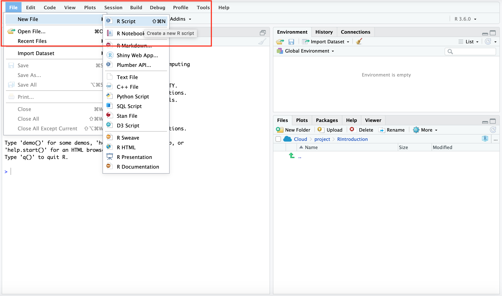
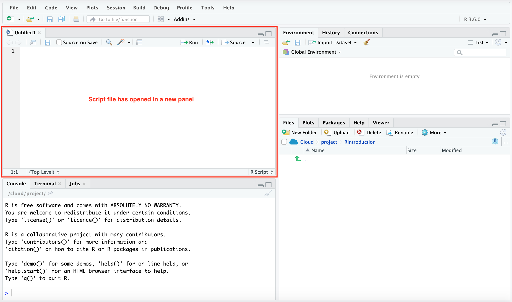

### Writting a script

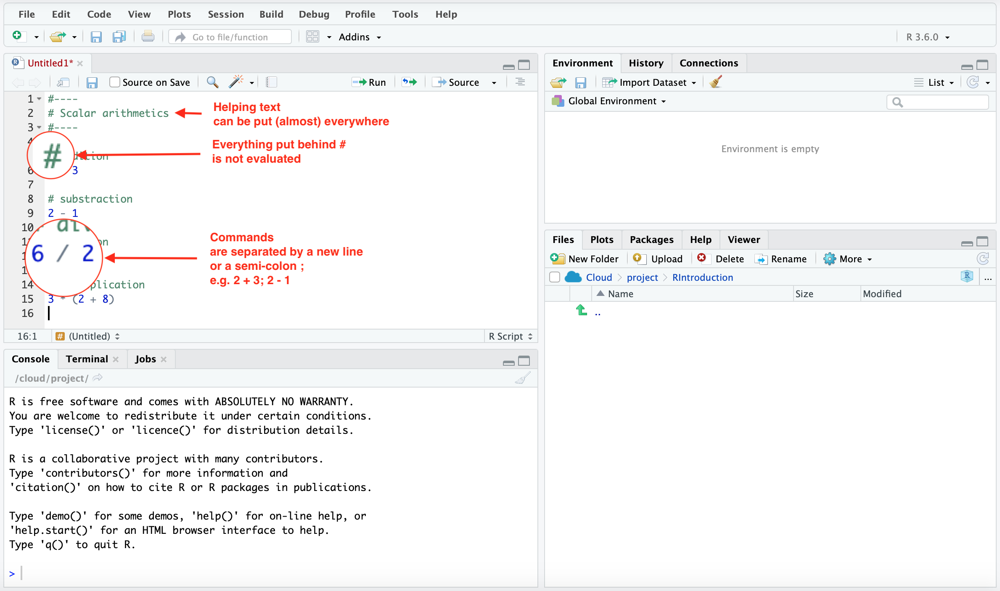

### Execute single code line

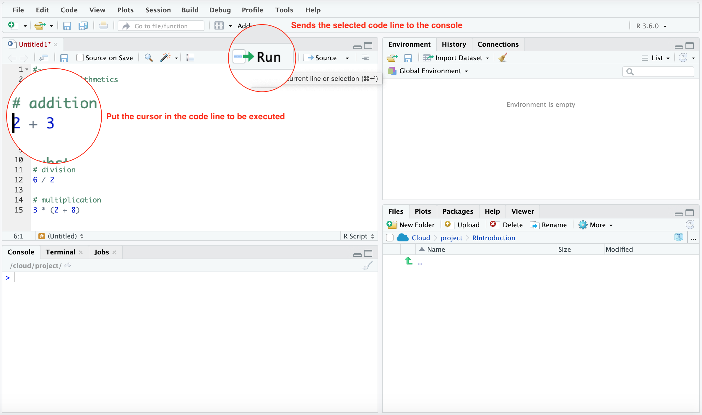
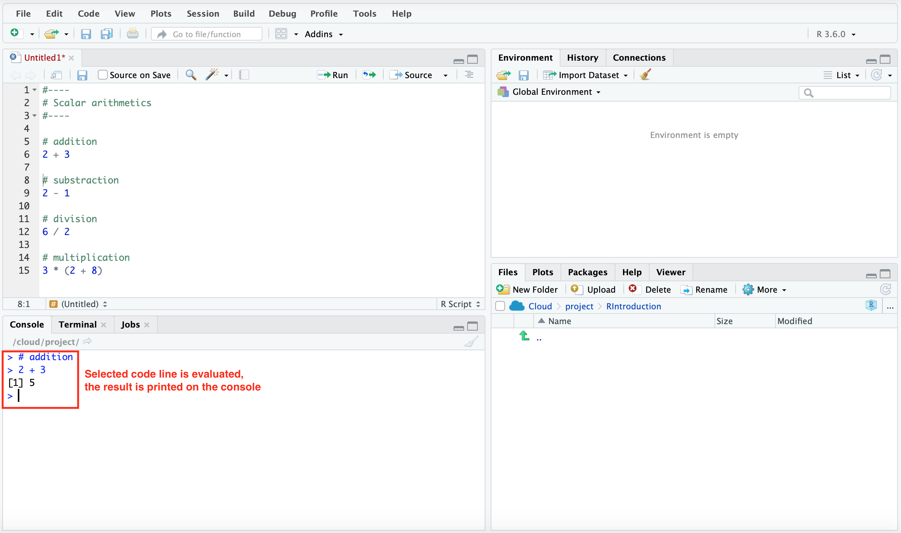

### Execute code selection

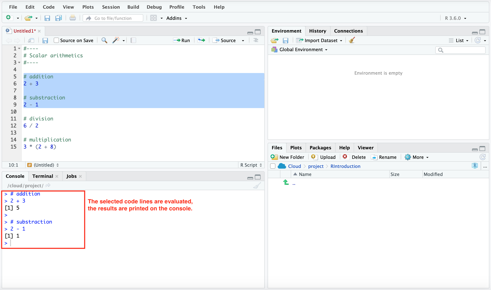

### Saving a script file

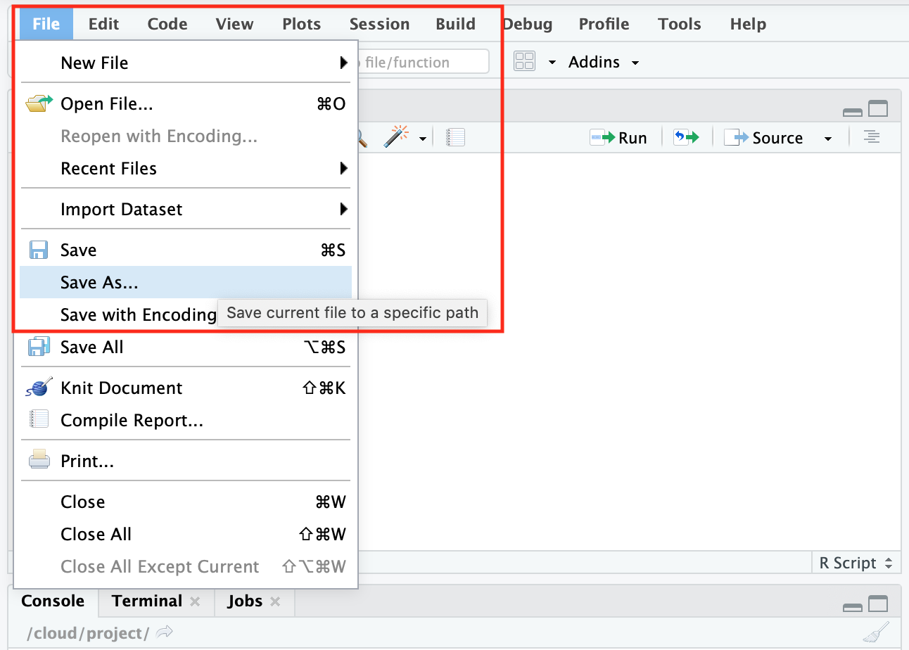 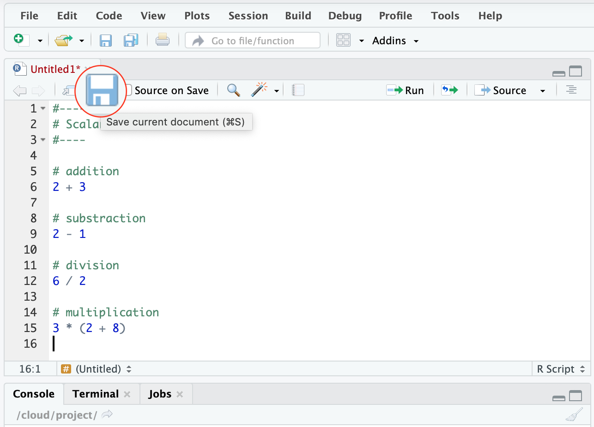

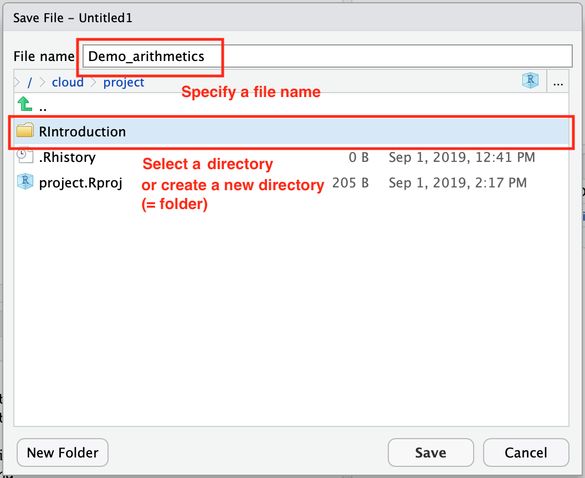 

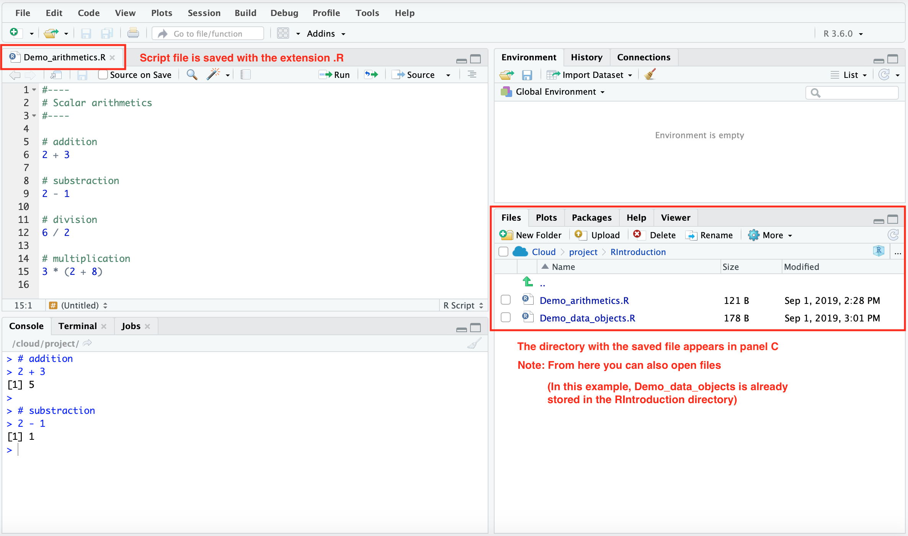

### Open an existing script file from the current directory

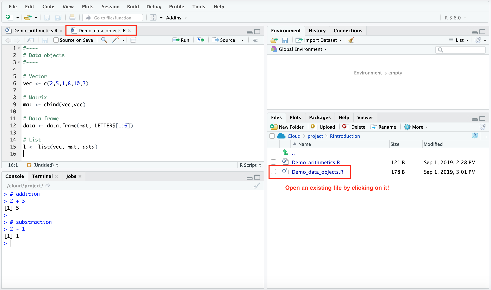

### Open an existing script file from another directory

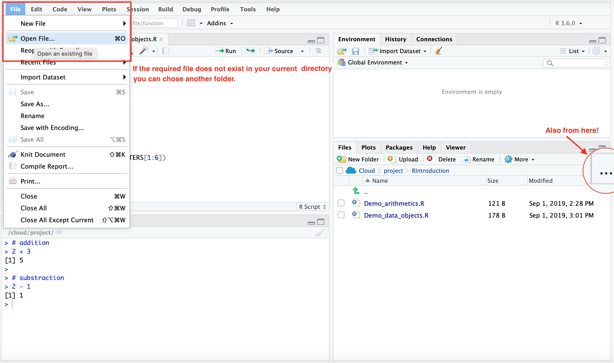

