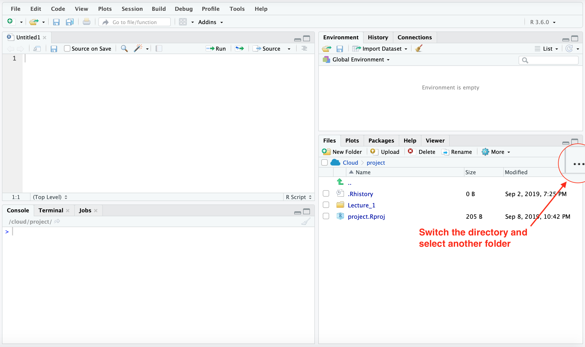
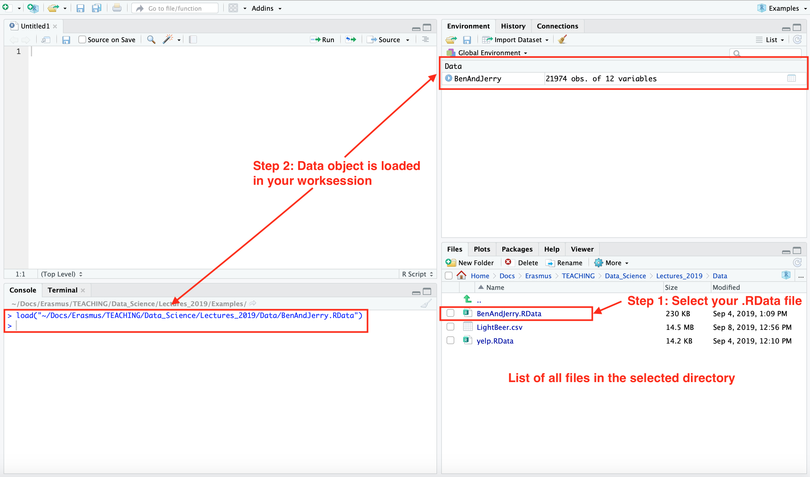
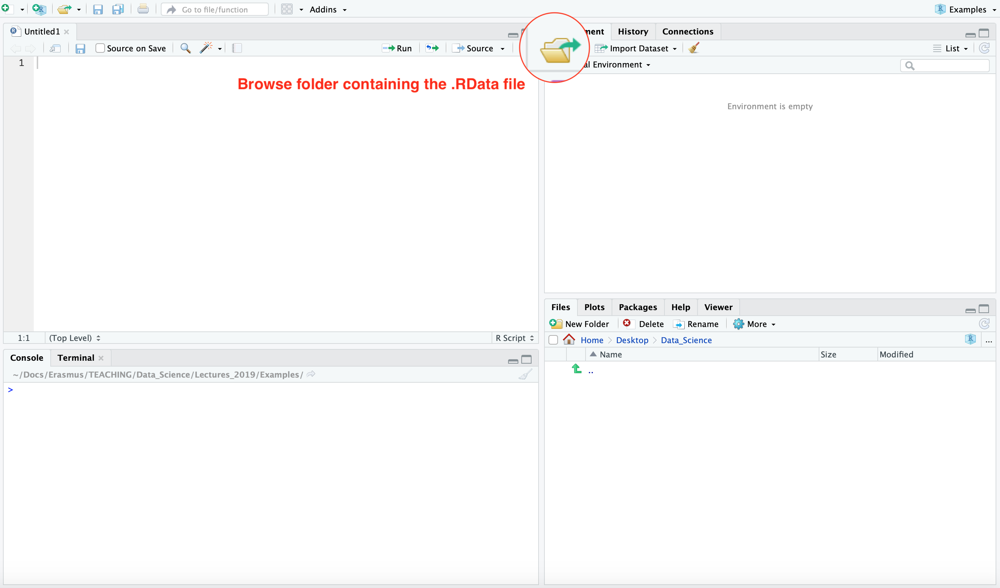
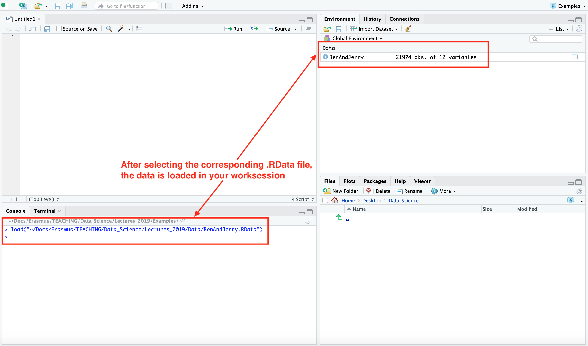

# Option 1: Changing the working directory

* When starting with R it is the best to work within the directory associated with your project and remain there for the duration of your session. 

* Changing the working directory (from the user home directory which is the default) creates a direct association between RStudio and the .RData and/or .R files in your folder. Thus, you can load all .RData files directly into your workspace and open .R files at any time by clicking on them.

# Option 2: Connecting to another folder

* Sometimes, it is necessary to import .RData files from another folder without changing the working directory. You can easily do this via the **Environment** tab in RStudio. There, you can open a connection to the folder where you want to have the .RData file imported from.

* After selecting the file it is directly loaded into your workspace.

