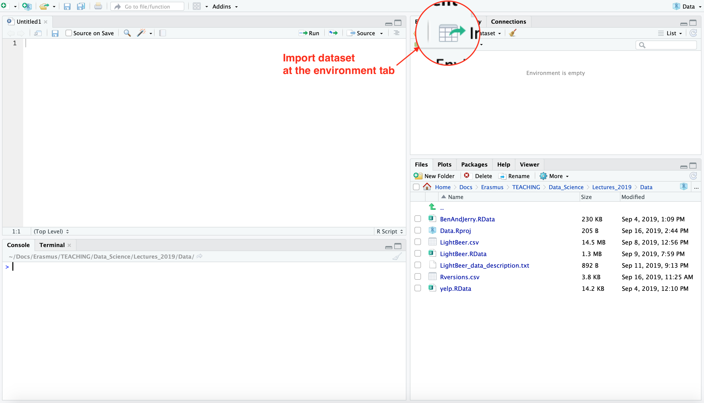
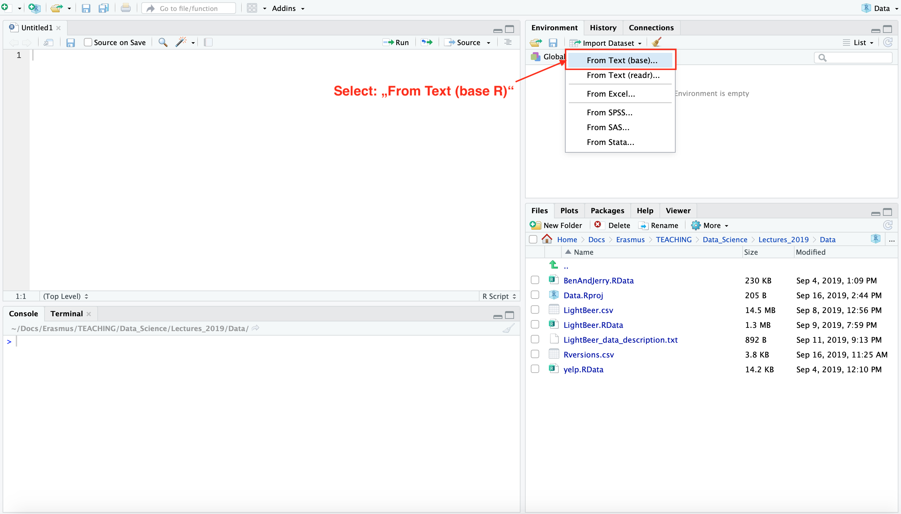
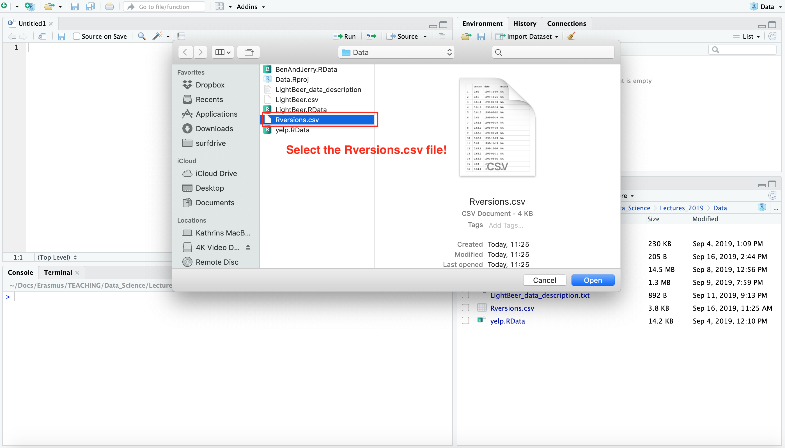
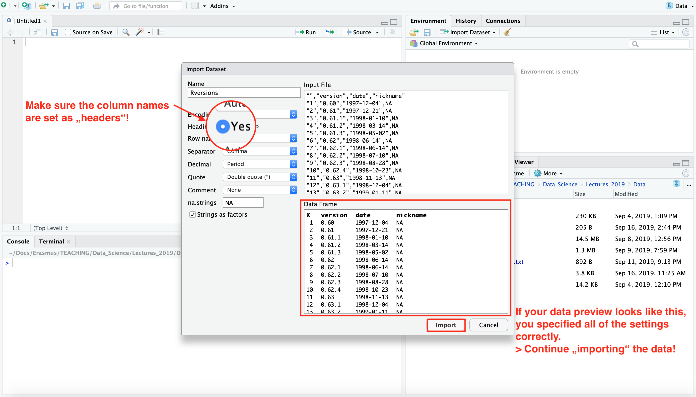
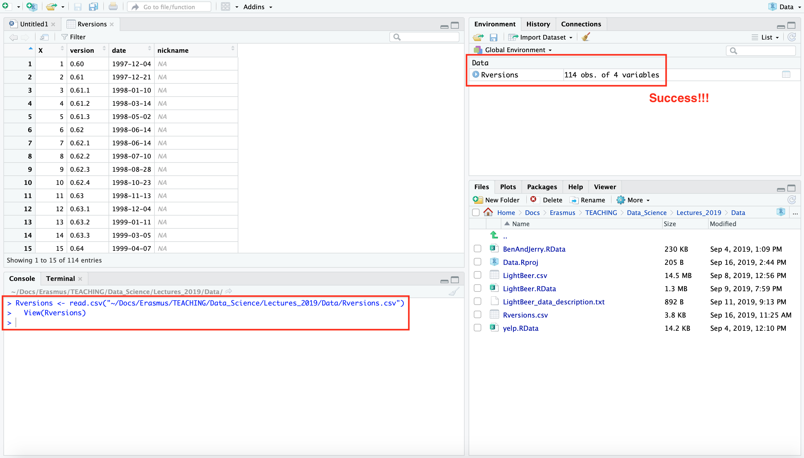
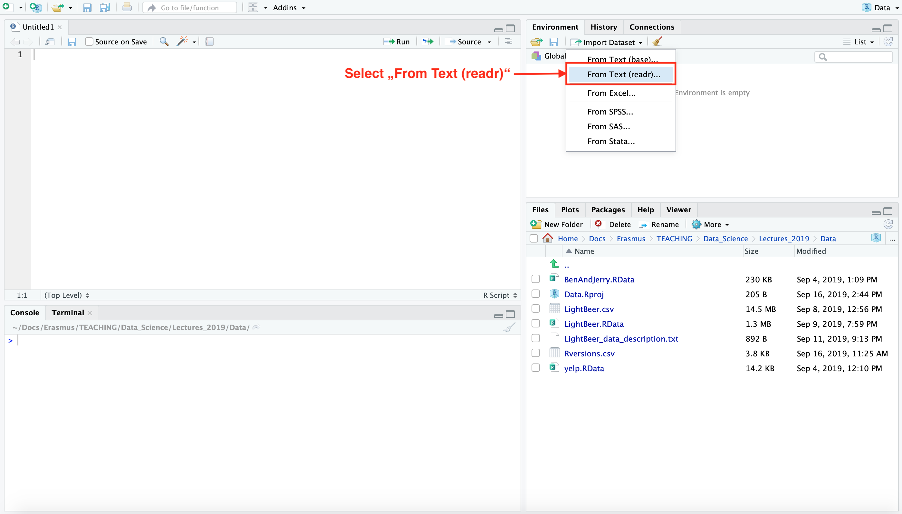
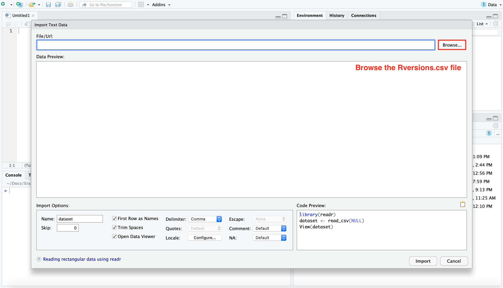
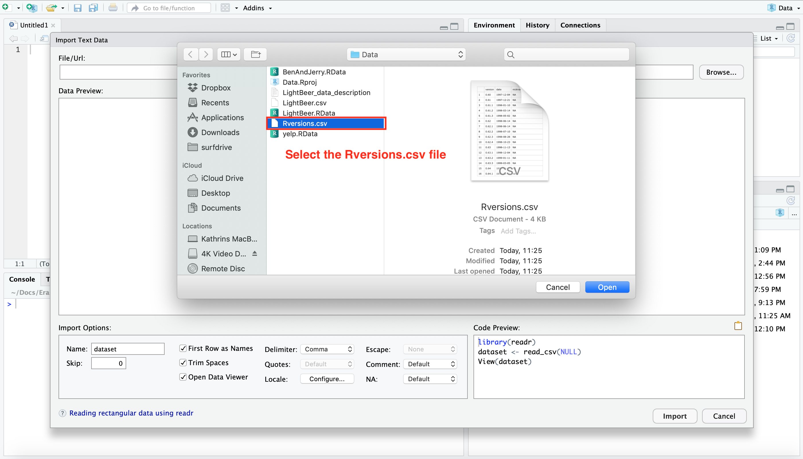
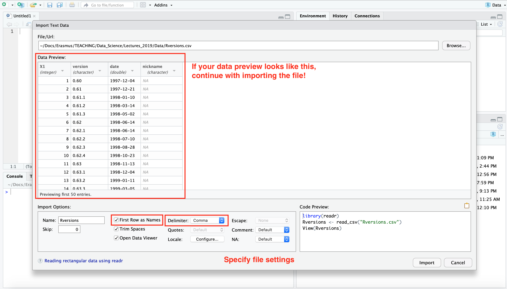
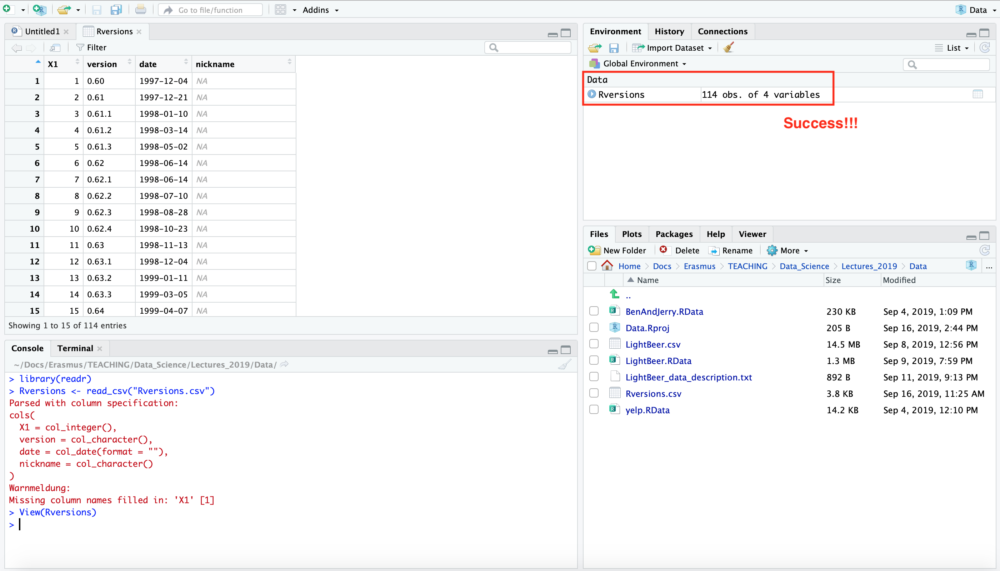

# Option 1: Base R

_Step 1:_ Click on the **import** dataset button in the top-right section under the **environment tab**. Choose **From Text (base R)** and select the file you want to import. Next, the import dataset dialog will appear as in the example shown below:

_Step 2:_ Set up the preferences of separator, name and other parameters, click on the **import** button. The dataset will be imported in R Studio and assigned to the variable name as set before.

**Headings**:

* The first row of the data file is usually reserved for the header (best practice: use the first column to identify 
the sample unit).
* Note: short column names are prefered over longer names.

**Separator**:

* .csv: the filed separator character is set to `,` (or `;`) by default (**comma-separated** files).

* .txt: the field separator character is set to `""` or white space by default (**tab-delimited** files). White spaces also indicate tabs, newlines or carriage returns. 

* other formats: if your file uses another symbol to separate the fields of your data set (like e.g. `/`), indicate this by sepcifying the corresponding symbol in the separator field.

**Decimal**:

* The Decimal field allows you to specify the character for the decimal mark. 

# Option 2: The `readr` package

