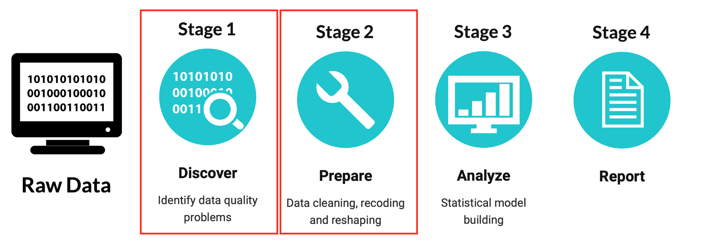

# The data science process



# Discover

* Real-world data is generally noisy, incomplete and inconsistent. The initial exploration of the raw data set helps you to spot such data quality problems. 

* Scanning your data also helps you to discover first insights into it and provides guidance on applying the right kind of further statistical treatment to it.

<br>

# Prepare and Analyse

* Analytical models fed with poor quality data can lead to misleading predictions. The data preparation stage resolves data issues and ensures the dataset used in the modeling stage is acceptable and of improved quality. 

* Data preparation tasks are likely to be performed multiple times during interactive data analysis and model building stages (also called **data wrangling** or **data munging**). That's why data prepartion typically consumes around 80% of overall time of an analytics project.

<br>

## Stage 1: Discover

Data inspection constitutes a set of simple tools to answer questions like:

> Question 1: What is the size the data set? 

> Question 2: What variables are included? 

> Question 3: Are there implausible/ missing values?

> Question 4: How are values distributed over variables? 

**Example:** _Ben\&Jerry ice-cream_. Subsample of the _Nielson homescan data_,a consumer panel consisting of 70,000 households and all of their purchases. 

<br>

**Question 1: What is the size of the data set?**

Check the number of columns and rows (or alternatively the dimension) of the data set:

```{r}
nrow(BenAndJerry)
ncol(BenAndJerry)
dim(BenAndJerry)
```

<br>

**Question 2: What variables are included?**

Check the column names:

```{r}
names(BenAndJerry)
```

Display the first observations:

```{r}
head(BenAndJerry)
```

Display the last observations:

```{r}
tail(BenAndJerry)
```

Display the structure of the data set:

```{r}
str(BenAndJerry)
```

Here: one line for each column in the data set (including its name, data type and the first few observations) is displayed. 

<br>

**NOTE!** The `str()`-function gives a reasonable output for any R object by compactly displaying its content. It is particularly well-suited for **list** objects (Recap: a list is a generic vector containing other objects). 

Technically, R considers a **data frame** internally as a list object. Thus, a data frame is a **list of equal-length vectors**. Therefore, the `length()` of a data frame is the length of the underlying list and gives the same result as `ncol()`; whereas `nrow()` gives the number of rows.

```{r}
length(BenAndJerry)
```

```{r}
ncol(BenAndJerry)
```

```{r}
nrow(BenAndJerry)
```

**Hint:** Use `$` to extract columns by their name!

```{r}
head(BenAndJerry$price_paid_deal)
```

<br>

**Question 3: Are there implausible/ missing values?**

Check for observations with 0 or negative pruchases:

```{r}
BenAndJerry$total_spent <= 0
```

```{r}
head(BenAndJerry$total_spent <= 0)
```

Here: the result is of type **logical**. 

Internally, R treats `TRUE` and `FALSE` as `0` and `1` values. Thus, we can sum over all `TRUE` and `FALSE` values and do not need to check each single value:

```{r}
sum(BenAndJerry$total_spent <= 0)
```

There are no observations with 0 or negative purchases.

<br>

More logical operators

* larger than: `>`; less than: `<` 

* larger than or equal to: `>=`; less than or equal to: `<=`

* exactly equal to: `==`; not equal to: `!=`

* negotiation of x: `!x`

* all x values larger than 0 AND smaller than 1: `(x > 0) & (x < 1)` 

* any x value larger than 0 OR smaller than 1: `(x > 0) | (x < 1)` 


**NOTE!** Check for observations with missing purchases (missings are coded with `NA`):

```{r}
is.na(BenAndJerry$total_spent)
```

```{r}
head(is.na(BenAndJerry$total_spent))
```

```{r}
sum(is.na(BenAndJerry$total_spent))
```

There are no missing values for purchases.

<br>

**Question 4: How are values distributed over variables?**

Calculate the average price paid for deal and non deal:
```{r}
mean(BenAndJerry$price_paid_deal)
mean(BenAndJerry$price_paid_non_deal)
```

Calculate the spread of the values:
```{r}
var(BenAndJerry$price_paid_deal)
sqrt(var(BenAndJerry$price_paid_deal))
sd(BenAndJerry$price_paid_deal)
```

More statistic functions

* `min()` / `max()` (minimum, maximum value)

* `range()` (`max()` - `min()`)

* `median()` 

* `mode()`

```{r}
summary(BenAndJerry)
```

<br>

## Stage 2: Prepare

Data preparation covers all activities used to construct the final dataset from the initial raw data

* Creating new data objects (transform or recode values)
* Excluding implausible values (subset)
* Constructing new data sets (aggregate over observations, reshape the data set)

**Example:** _Ben\&Jerry ice-cream_ (continued).

<br>

Calculate the `price_paid_deal` and `price_paid_non_deal` per unit. Create two new data objects `Unit.price.deal` and `Unit.price.non.deal`:

```{r}
Unit.price.deal <- BenAndJerry$price_paid_deal/BenAndJerry$quantity
Unit.price.non.deal <- BenAndJerry$price_paid_non_deal/BenAndJerry$quantity
```

Calculate the average unit price paid for deal and non deal:
```{r}
mean(Unit.price.deal)
mean(Unit.price.non.deal)
```

The newly created unit price data vectors can also be appended to the data matrix by using `$`:
```{r}
BenAndJerry$Unit.price.deal <- Unit.price.deal
BenAndJerry$Unit.price.non.deal <- Unit.price.non.deal
```

```{r}
names(BenAndJerry)
```
The unit price data vectors are added on the last position (the last two columns).

It might be useful to also examine `Unit.price.deal` and `Unit.price.non.deal` in combination with other attributes like `size1_descr` (package size), `formula_descr` (fat) and `flavor_descr` (flavor). This can be done by using the **`aggregate()`**-function: 

~~~
aggregate(formula, data, FUN, subset, na.action = na.omit, ...)
~~~

* `formula`: A formula argument where the response variables are numeric data, to be split into groups according to the values in the predictor variables.

* `data`: data frame or list.

* `FUN`: function to compute the summary statistics, for example, `mean()` or `var()`.

* `subset`: specify a subset of the observations to be analysed (see also `subset()`).

* `na.action`: what should happen with observations containing `NA` (missing) values? (ignored by default)

<br>

**NOTE!** In R, formulas are used to express a relationship between variables. Most commonly, the relationship between one **response** and one (or several) **predictor** variable(s) is described. 

The formula is characterized by the tilde `~` symbol. The **response** variable stands on the **left** hand side and the **predictor** variable on the **right** hand side of the tilde: 

`response ~ predictor`

* Predictor variables can be added with the plus `+` symbol:

`response ~ predictor1 + predictor2`


More formulas

* leave out predictor2:

`response ~ predictor1 - predictor2`

* tensor product (interactions) of predictor1 and predictor2:

`response ~ predictor1 : predictor2`

* crossing:

`response ~ predictor1 * predictor2`

 same as

`response ~ predictor1 + predictor2 + predictor1 : predictor2`

<br>

In the following, we consider `Unit.price.deal` as the response variable and `size1_descr` as the predictor variable for specifying the formula argument in the **`aggregate()`**-function:

```{r}
aggregate(Unit.price.deal ~ size1_descr, 
          FUN = mean, data = BenAndJerry)
```
Groups the average `Unit.price.deal` according to the different package sizes.

```{r}
aggregate(Unit.price.deal ~ size1_descr + formula_descr, 
          FUN = mean, data = BenAndJerry)
```

```{r}
aggregate(Unit.price.deal ~ size1_descr * formula_descr, 
          FUN = mean, data = BenAndJerry)
```

Groups the mean of `Unit.price.deal` according to package size crossed with amount of fat (_factorial design_).

```{r}
aggregate(Unit.price.deal ~ size1_descr + formula_descr, 
          FUN = mean, subset = total_spent > 0 , data=BenAndJerry)
```

Only observations with purchases larger than 0 are considered (i.e. purchases smaller than or equal to 0 are excluded).


```{r}
aggregate(cbind(Unit.price.deal,Unit.price.non.deal) ~ size1_descr + formula_descr,
          FUN = mean, subset = total_spent > 0 , data = BenAndJerry)
```

Groups both the average `Unit.price.deal` **and** `Unit.price.non.deal` according package size and fat.

<br>

# The tidyverse package
(see also R for Data Science, Chapter 3, or https://r4ds.had.co.nz/transform.html Chapter 1.5)

* The add-on package **`tidyverse`** packages the data science process together. It is a collection of other R packages for data exploration and manipulation (**`dplyr`**), data resphaping (**`tidyr`**) and data visualization (**`ggplot`**) (for a detailed description see https://www.tidyverse.org).

* All packages make use of the pipe operator `%>%` (from the **`magritrr`** package) to string multiple data processing tasks together.

**NOTE!** After installing the **`tidyverse`** package you need to make it available in your current worksession. You can do both either via the _packages tab_ in the lower-right panel of RStudio or via the command lines:

```{r}
install.packages("tidyverse")  # download package from CRAN
library(tidyverse)             # load package into your worksession          
```
```{r}
library(tidyverse)             # load the tidyverse package into your current worksession          
```

The `%>%` operator forwards a value, or the result of an expression, into the next function call/expression. For example, the average `Unit.price.deal` is usually calculated as:
```{r}
mean(BenAndJerry$Unit.price.deal) 
```
Within **`tidyverse`** this becomes:
```{r}
BenAndJerry$Unit.price.deal %>%   # forward unit price into mean()
    mean()
```

Check for observations with missing purchases:
```{r}
sum(is.na(BenAndJerry$total_spent))
```
Within **`tidyverse`** this becomes:
```{r}
BenAndJerry$total_spent %>%      # forward spendings into is.na()
  is.na() %>%                    # forward the result of is.na() into sum()
     sum()              
```

<br>

The **`dplyr`** package provides a set of functions that help solve the most common data manipulation challenges:

* `mutate()`: adds new variables that are functions of existing variables.
* `group_by()`: groups data by categorical variables.
* `summarise()`: summarizes the data.
* `select()`: picks existing variables based on their names.
* `filter()`: picks existing observations based on their values.
* `arrange()`: changes the ordering of the rows in the output.

Check for observations with 0 or negative pruchases:

```{r}
BenAndJerry %>%
  mutate(selection = total_spent <= 0) %>%
    summarize(sum. = sum(selection))
```

Calculate the `price_paid_deal` \underline{per unit}. Obtain the average unit price grouped by `size1_descr` (package size) and `formula_descr` (fat).

```{r}
BenAndJerry %>%
  mutate(Unit.price.deal = price_paid_deal/quantity) %>%
    group_by(size1_descr, formula_descr) %>%
      summarize(mean = mean(Unit.price.deal))
```

Putting it all togehter: 

```{r}
BenAndJerry %>%
  filter(total_spent > 0) %>%
    mutate(Unit.price.deal = price_paid_deal/quantity) %>%
      group_by(size1_descr, formula_descr) %>%
         summarize(n = n(),
           mean = mean(Unit.price.deal),
           sd = sd(Unit.price.deal))
```
