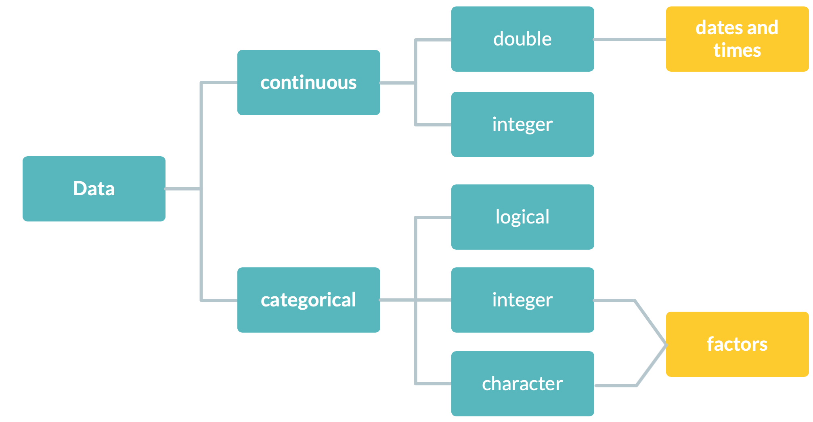

# Data types (revised)

In a dataset, we can distinguish two types of variables:



**Continuous**:

* unlimited number of double \& integer values

**Categorical**:

* limited number of integer \& character values

**NOTE!** Character values are not supported in statistical models. The only way to consider them is to convert them to a vector of integers. 

<br>

# Factors in R

(see also R for Data Science, Chapter 12, or https://r4ds.had.co.nz/factors.html Chapter 2.15)

**Factors** store character values as integers. The character values are treated as labels associated with a set of unique integer values. This ensures that the statistical function used will treat such data correctly.

In R the `factor()`-function is used to create and modify factors: 

~~~
factor(x = character(), levels, labels = levels, ordered = is.ordered(x))
~~~

* `x`: a vector of distinct data values that will be returned as a vector of factor values.

* `levels`: (optional) a vector of the unique character values that `x` might take on. The default is the unique set of values taken by `as.character(x)`, sorted into increasing order of `x`. 

* `labels`: `(optional)` a character vector of labels for the levels (in the same order as levels). Duplicated values in labels can be used to map different values of `x` to the same factor level.

* `ordered`: logical flag to determine if the levels should be regarded as ordered (in the provided order).

<br> 

**Example:** _Ben\&Jerry ice-cream_ (continued).

| **continuous** | **categorical** |
|-----------------------------------------------|------------------------------------------------|
| price paid, coupon value, total spendings, quantity | promotion type, package size, flavor, formula description |

```{r}
str(BenAndJerry)
```

**NOTE!** In the dataset `size1_descr`, `flavor_descr` and `formula_descr` are character values. We have to convert them into **factors** to properly work with them!


```{r}
fat.content <- factor(BenAndJerry$formula_descr)
```
```{r}
head(fat.content)
```

In R’s memory, `LIGHT HALF THE FAT` and `REGULAR` are represented by the numbers `1` and `2`. The levels `LIGHT HALF THE FAT` and `REGULAR` are used when the factor is displayed. This is also more descriptive than 1 and 2.

You can also check the levels of a factor with `levels()`, and the number of levels with `nlevels()`:

```{r}
levels(fat.content)
nlevels(fat.content)
```

**NOTE!** A factors levels will always be character values. As a consequency, factors look like character vectors but they are actually integers.

<br>

The function `summary()` handles factors differently to characters (and numbers):

```{r}
summary(BenAndJerry$formula_descr)
```

```{r}
summary(fat.content)
```

The occurrence counts for each value is often more useful information.

<br>

## Unordered vs. ordered factors

The default order of the factor levels is **alphabetical**. Thus, R will assign 1 to the level `LIGHT HALF THE FAT` and 2 to the level `REGULAR` (because "L" comes before "R", even though the first element in this vector is `REGULAR`).

Sometimes, the order of the factor does not matter, other times you might want to specify the order because it is meaningful or it is required by a particular type of analysis (like changing the reference to consider a certain category as baseline).

```{r}
levels(fat.content)  # raw data levels
```

```{r}
min(fat.content)     # doesn't work
```

~~~
Error in Summary.factor(c(2L, 2L, 2L, 2L, 2L, 2L, 2L, 2L, 2L, 2L, 2L,  : 
  ‘min’ not meaningful for factors
~~~

**NOTE!** For unordered factors only the logical operators  `==` and `!=` can be used for comparing levels. Meaning: a factor can only be compared to another factor with an identical set of levels (not necessarily in the same ordering) or to another character vector. Specifying the order of the levels allows us to compare levels:

```{r}
fat.content <- factor(fat.content, levels = c("LIGHT HALF THE FAT", "REGULAR"), 
                      ordered = TRUE) # order levels
min(fat.content)     # works!
```

Ordered factors are compared in the same way as unordered factors, but the general dispatch mechanism precludes comparing ordered and unordered factors. Thus, on ordered factors the `min()`, `max()`, and `range()` functions can be applied (and for unordered factors R will generate an error).

Another way of changing the order of factor levels is offered by the `relevel()`-function. The `relevel()`-functions sets a specific value as a reference (= the first value in the level list): 

```{r}
div.fat <- factor(sample(c("regular", "skimmed", "light"), 
                          size = 10, replace = TRUE))
```

```{r}
div.fat <- relevel(div.fat, ref = "skimmed") # Make skimmed first
div.fat
```

```{r}
div.fat <- relevel(div.fat, ref = "regular") # Make regular first
div.fat
```

**NOTE!** `relevel()` won't work for ordered factors!

<br>

## Renaming factor levels

Rename _all_ levels by using **replacement operations**: 

```{r}
div.fat <- factor(sample(c("regular", "skimmed", "light"), 
                         size = 10, replace = TRUE), 
                  levels=c("regular","light","skimmed"), ordered=TRUE)
```
```{r}
levels(div.fat) <- c("10% fat", "6% fat", "0% fat")
div.fat
```

**NOTE!** This method will modify `div.fat` directly! Thus, you don’t have to save the result back into `div.fat`.

You can also rename _single_ levels by indexing:

```{r}
levels(div.fat)[levels(div.fat) == "light"] <- "6% fat"
levels(div.fat)
```

**NOTE!** Specific elements in a vector can be accessed by `[]`. The principle is similar to using the `subset()`-function but using square brackets allows you to assign values to a specific element which is not possible with `subset()`. 

In addition, using square brackets allows you to access specific elements in a vector by position:

```{r, eval=FALSE}
levels(div.fat)[1] <- "6% fat"  # access first level by position
levels(div.fat)[2] <- "10% fat" # access second level by position
```

In general, you can do the same in a more convenient way with the `revalue()` or `mapvalues()`-functions from the `plyr` package.

```{r}
# install.packages("plyr")
library(plyr)
```

```{r}
div.fat <- factor(sample(c("regular", "skimmed", "light"), size = 10, replace = TRUE), 
                  levels=c("regular","light","skimmed"), ordered=TRUE)
```

Rename _several_ levels with **`revalue()`** and **`mapvalues()`**:

```{r}
revalue(div.fat, c("regular" = "10% fat", "light" = "6% fat"))
mapvalues(div.fat, from = c("regular", "light"), to = c("10% fat", "6% fat"))
```

<br>

# Dates and times in R

(see also R for Data Science, Chapter 13, or https://r4ds.had.co.nz/dates-and-times.html Chapter 2.16)

Often data is collected at regular intervals (e.g. Google Analytics data for customer tracking) and thus, comes with dates and time stamps. R allows you to analyze date and time values from many different perspectives. 

In R the easiest way to convert a character into a date is to use the `as.Date()`-function: 

~~~
as.Date(x, format, tryFormats = c("%Y-%m-%d", "%Y/%m/%d"), ...)
~~~

* `x`: an object to be converted.

* `format`: (optional) character string specifying the input format. If not specified `tryFormats` is used.

* `tryFormats`: character vector of format strings to try if format is not specified.

The `as.Date()` function allows a variety of input formats through the `format` argument. The default format is a four digit year, followed by a month, then a day, separated by either dashes or slashes:

```{r}
as.Date("1915-6-16")
as.Date("1990/02/17")

as.Date("9/17/19", format = "%m/%d/%y")
```

If the input dates are not in the standard format, a format string can be composed using the following elements:

| Code | Value |
|------|-------------------------------|
| %d | Day of month (decimal number) |
| %m | Month (decimal number) |
| %b | Month (abbreviated) |
| %B | Month (full name) |
| %y | Year (2 digits) |
| %Y | Year (4 digits) |

In R dates are stored internally as the number of days or seconds since January 1, 1970 (using negative numbers for earlier dates). Thus, dates in R will generally have a **numeric** data type. 

The `as.numeric()` function can be used to convert a date object to its internal form:

```{r}
dates <- as.Date(c("1/10/70", "10/1/70", "1/1/00", "9/17/19"), 
                 format = "%m/%d/%y") # dates in non-standard format
dates
```

```{r}
as.numeric(dates)  # obtain the days passed since January 1, 1970
```

To extract the date components, the `weekdays()`, `days()`, `months()` or `quarters()`-functions can be used:

```{r}
weekdays(dates)    # find the day of the week
```
~~~
"Saturday" "Thursday" "Saturday" "Tuesday" 
~~~

It is also possible to use the `seq()`-function (or alternatively the `seq.Date()`-function) to create a vector of dates. For example, to a sequence of each day of the year 2019 can be obtained as:

```{r}
year.2019 <- seq(from = as.Date("2019-1-1"), to = as.Date("2019-12-31"), 
                 by = "day")
```

```{r}
year.2019 <- seq.Date(as.Date("2019-1-1"), to = as.Date("2019-12-31"), 
                      by = "day")
head(year.2019)
```

**NOTE!** Dates are internally treated as **numeric** data types. This allows us to perform a variety of calculations:

```{r}
median(year.2019)
min(year.2019)
min(year.2019)
range(year.2019)
```

<br>

## Arithmetics

**NOTE!** If two dates are subtracted, R will return the results in the form of a **time difference**:

```{r}
year.2019[11] - year.2019[1]
```

Other units of time differences can be calculated with the `difftime()`-function:

~~~
difftime(time1, time2, tz,
         units = c("auto", "secs", "mins", "hours", "days", "weeks"))
~~~

* `time1`, `time2`: date-time or date objects.

* `tz`: (optional) time-zone specification (mainly for "POSIXlt" objects).

* `units`: character string specifying the units in which the results are desired (can also be abbreviated).

```{r}
difftime(year.2019[11], year.2019[1], units="mins")
difftime(year.2019[11], year.2019[1], units="hours")
```

**NOTE!** Conceptually, adding and substracting values to dates is a tricky topic. What does it mean to "add one month" to a date? For example (and I think we all agree) one month after 2018-01-01 is 2018-02-01. But what's one month after 2018-01-31?

```{r}
dates <- seq(as.Date("2019-1-31"), to = as.Date("2019-12-31"), 
             by = "month")
dates
```

Here, R is literally adding 1 to the month component of each date. Obviously, dates like 2018-02-31 and 2018-04-31 don't exist, so R counts the difference between the day component and the last valid date in each month, and then adds that amount to the last valid month to get a valid date. For example, 2018-02-31 is (in a sense) three days after 2018-02-28, so R resolves the date to 2018-03-03.

Here, the `lubridate` package provides functionality for adding months to a date that behaves slightly differently.

```{r}
install.packages(lubridate)
library(lubridate)
```

```{r}
dates <- as.Date("2018-01-31") %m+% months(seq(0,12))
dates
```

Extracting date components with `lubridate`:

```{r}
month(dates)  # extract the month
```

```{r}
wday(dates, label = TRUE)    # find the day of the week
```

<br>

## More arithmetics

**Example:** calculate the time difference between two events. 

```{r}
start <- c("2019-08-21", "2019-09-01", "2019-08-15", "2019-09-18")
end <- c("2019-09-16", "2019-09-06", "2019-08-22", "2019-10-11")
elapsed.time <- start %--% end
```

The time difference (elapsed time) in seconds is obtained with `as.duration()`:
```{r}
as.duration(elapsed.time)
```

Alternatively, the time differences can be converted to another unit of time such as weeks or days:
```{r}
as.duration(elapsed.time) / dweeks(1)
```
The function call `dweeks(1)` generates a duration of one week in seconds, which is 604800. Dividing that into duration returns the number of weeks. You can do the same with `dhours(1)` (one hour), `ddays(1)` (one day), `dminutes(1)` (one minute) and `dyears(1)` (one year).
