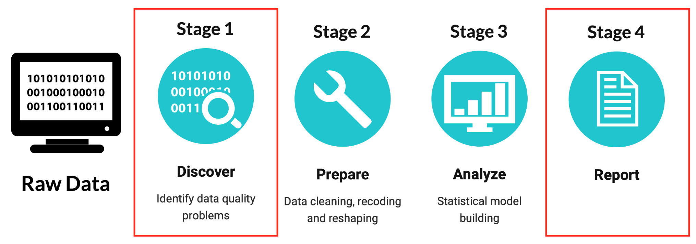
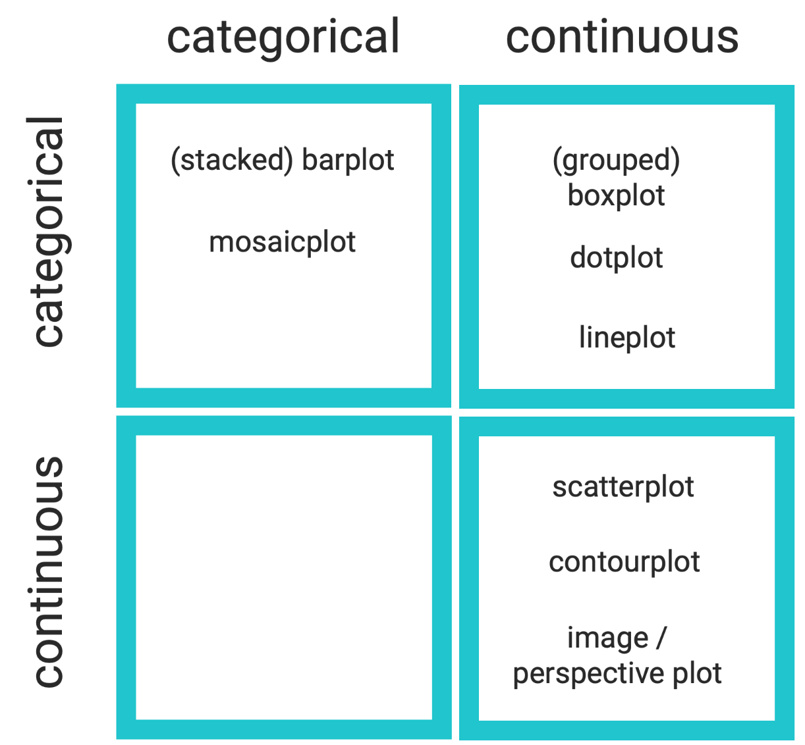
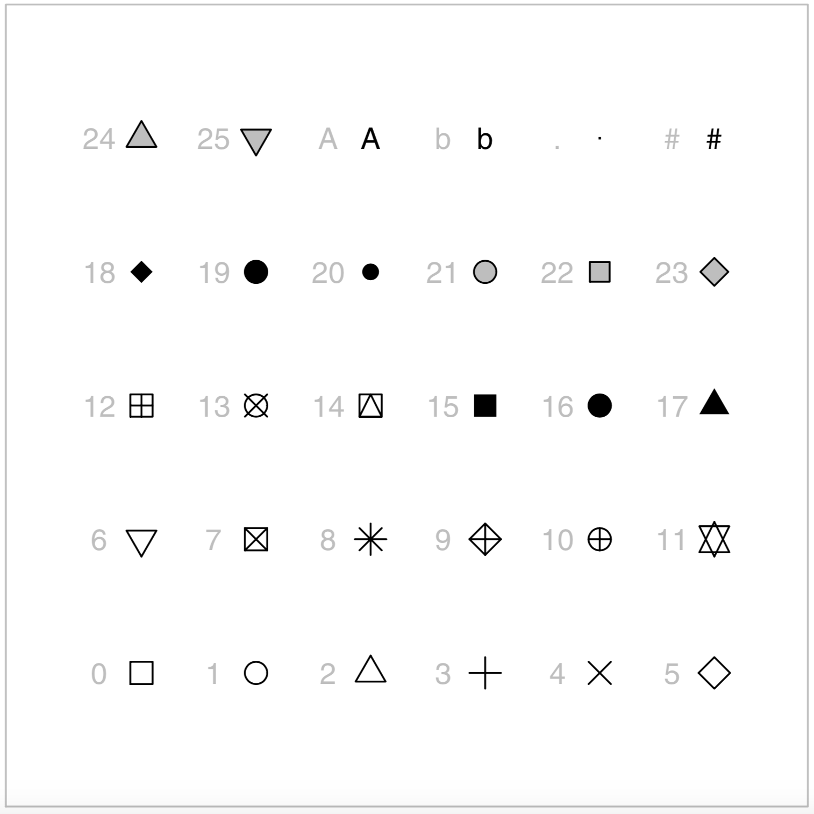
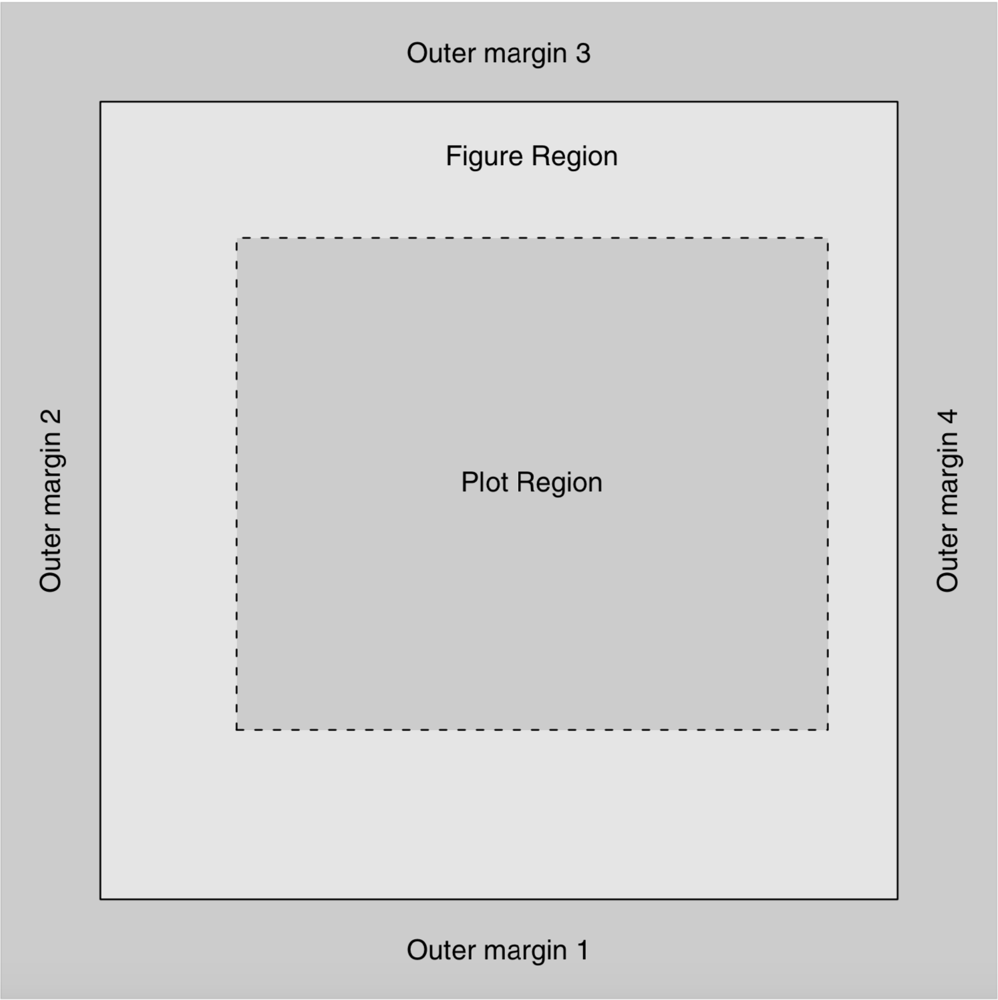
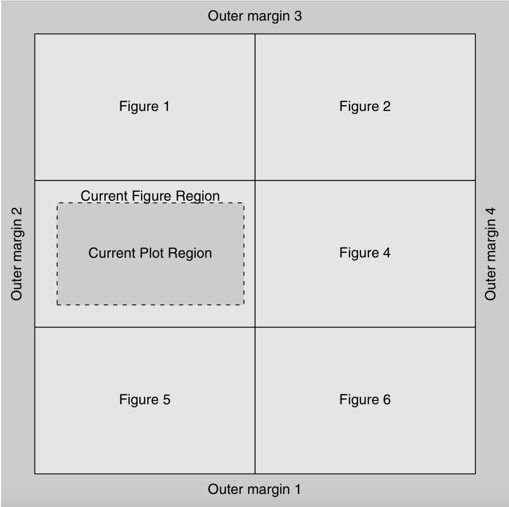

# The data science process



Data visualisation is an important tool for generating and communicating insights.

**Exploratory graphs**: 

* Describing data, detecting patterns and trends.

* Produced instantly using default settings.

**Illustrative graphs**: 

* Illustrating a conclusion, making a convincing argument.

* Require changing graph titles, axis, labels, colors, symbols, adding legends, ... or adding information.

R includes at least three graphical systems: 

1. The **standard graphics** package, 
2. The **lattice** package for Trellis graphs and 
3. The **ggplot2** package based on the idea of the grammar-of-graphics.

<br>

In R graphs are build-up in two stages by successively calling graph functions:

1. Creating an (**exploratory**) default graph.
2. **Customizing** and **annotating** the default graph. 

<br>

# Exploratory graphs

**Example**: _Bike sharing Chicago_.

```{r}
Chicago.agg <- read.csv("Chicago.agg.csv")
```

```{r}
str(Chicago.agg)
```

(Default) histogramm:

```{r}
hist(Chicago.agg$tripduration)
```

(Default) boxplot:

```{r}
boxplot(tripduration ~ events, data = Chicago.agg)
```

(Default) scatterplot:

```{r}
plot(tripduration ~ temperature, data = Chicago.agg)
```

## How to select among different graph types?



# Illustrative graphs

The final graph should help others to quickly built up a good mental model of the data and the business problem at hand. Therefore, it is necessary to change different aspects of the appearance of a plot (**customizations**) as well as to add extra information (**annotations**). 

## Customizations

* Change the **title**, **axis labels**, and **coordinate system** with `main`, `xlim` and `xlab` / `ylab`:

```{r}
# (as usual) perform some data preparation tasks fist:

# 1. transform fahrenheit to celsius
Chicago.agg$temperature <- (Chicago.agg$temperature - 32) * (5/9)

# 2. reshape the data to weekly observations
temp <- aggregate(temperature ~ week, FUN = max, data = Chicago.agg)
customers <- aggregate(no.customers ~ week, FUN = sum, data = Chicago.agg)
data <- data.frame("week" = temp$week, "temperature" = temp$temperature, 
                   "customers" = customers$no.customers/10000)
```

```{r}
plot(customers ~ temperature, main = "Chicago bike trips", 
     xlim = c(0, 40), xlab = "Temperature in Celsius", ylab = "No of customers", 
     data = data)
```

* Change the **size** of data symbols, title and axis labels with `cex`:

```{r}
plot(customers ~ temperature, main = "Chicago bike trips", 
     xlim = c(0, 40), xlab = "Temperature in Celsius", ylab = "No of customers", 
     cex = 2, cex.main = 2, cex.lab = 1.5, cex.axis = 1.5, 
     data = data)
```

The font size of text is specified in "points" (pt). The `cex` argument controls the font size by specifying a multiplicate modifier (**character expansion** factor = `fontsize` * `cex`).

* Change the **plotting symbol** with `pch`:

```{r}
plot(customers ~ temperature, main = "Chicago bike trips", 
     xlim = c(0, 40), xlab = "Temperature in Celsius", ylab = "No of customers", 
     cex = 2, cex.main = 2, cex.lab = 1.5, cex.axis = 1.5, 
     pch = 19,
     data = data)
```

The plotting symbols are controlled by the `pch` (**plotting character**) argument. R provides a fixed set of 26 symbols:



Some of the predefined plotting symbols (pch between 21 and 25) allow a fill color separate from the border color. In these cases, the fill color can be controlled with the `bg` setting.


* Change the **plot regions** and the **figure margins**:

In base R every page is split up into three main regions: (1) the **outer margins**, (2) the current **figure region**, and (3) the current **plot region**:



The `plot()`-function draws plotting symbols and lines within the plot region and axes and labels in the figure margins or outer margins. The size of these regions can be controlled via the `par()`-function and the graphics state settings `oma` (or `omi` in inches) for the size of the **outer margins** and `mar` (or `mai` in inches) for the size of the **figure margins**. 

Typing `par()` will result in a complete listing of the current graphics state settings: 

```{r, eval=FALSE}
par()
```

~~~
...
$mar
[1] 5.1 4.1 4.1 2.1
...
$oma
[1] 0 0 0 0
...
~~~

**NOTE!** Changes of the graphic state settings in `par()` only come into effect when the new plot is started. Then, they have a **persistent** effect and apply to **all** successive plots in the active R session until a different setting is specified.

We save the default graphic state settings in an object named `old.par` to be able switch back to it later:

```{r}
old.par <- par()
par(mar = c(5.1, 0, 4.1, 0) + 0.1) # set left & right figure margins to 0
```

```{r}
plot(customers ~ temperature, main = "Chicago bike trips", 
     xlim = c(0, 40), xlab = "Temperature in Celsius", ylab = "No of customers", 
     cex = 2, cex.main = 2, cex.lab = 1.5, cex.axis = 1.5, 
     pch = 19,
     data = data)
```

```{r}
par(old.par)  # switch back to default settings
```

* Change the **number of figures** in the plot region:

The number of figures in the plot region can be controlled via the `mfrow` and `mfcol` graphics state settings. Both of these consist of two values indicating a number of rows, _nr_, and a number of columns, _nc_; these settings result in _nr x nc_ figure regions of equal size:



The top-left figure region is used first. If the setting is made via `mfrow` then the figure regions along the top row are used next from left to right, until that row is full. After that, figure regions are used in the next row down, from left to right, and so on. When all rows are full, a new page is started.

```{r}
par(mfrow = c(1,2))  # fill-up figure regions row-wise
```
```{r}
hist(Chicago.agg$tripduration)
plot(tripduration ~ temperature, data = Chicago.agg)
barplot(tripduration ~ event, data = Chicago.agg)
```
```{r}
par(old.par)        # switch back to default settings
```

If the setting is made via `mfcol`, figure regions are used by column instead of by row.

## Annotations

Sometimes it is not enough to just modify the default graphic output. In many situations, further graphical output needs to be added to achieve the desired result.

* Adding **colors**:

The `col` argument is the most commonly used for adding (or changing) a default graphs color. The primary use is to specify the color of plotting symbols, lines, text, and so on that are drawn in the plot region. 

**Named colors**: the easiest way to specify a color in R is simply to use the color’s name. For example, `"red"` can be used to specify that plotting symbols in a scatterplot should be red: 

```{r}
plot(customers ~ temperature, main = "Chicago bike trips", 
     xlim = c(0, 40), xlab = "Temperature in Celsius", ylab = "No of customers", 
     cex = 2, cex.main = 2, cex.lab = 1.5, cex.axis = 1.5, 
     pch = 19,
     col = "red",
     data = data)
```

R understands 657 different color names. The full list of known color names can be obtained with the empty function call `colors()` or `colours()`.

```{r}
colors()
```
~~~
[1] "white"         "aliceblue"     "antiquewhite"  "antiquewhite1"
 [5] "antiquewhite2" "antiquewhite3" "antiquewhite4" "aquamarine"   
 [9] "aquamarine1"   "aquamarine2"   "aquamarine3"   "aquamarine4"  
[13] "azure"         "azure1"        "azure2"        "azure3"       
[17] "azure4"        "beige"         "bisque"        "bisque1"      ...
~~~


**RGB colors**: it is also possible to specify colors using one of the standard color-space descriptions. The `rgb()`-function allows a color to be specified as a **Red-Green-Blue** (RGB) triplet of intensities. In RGB the color `"red"` is specified as `rgb(1, 0, 0)` (i.e., as much red as possible, no blue, and no green). To see the RGB values for a particular color name use the the `col2rgb()`-function:

```{r}
col2rgb("red")
```

**HSV colors**: there is also an `hsv()`-function for specifying a color as a **Hue-Saturation-Value** (HSV) triplet. **Hue** corresponds to a position on the rainbow, from red (0), through orange, yellow, green, blue, indigo, to violet (1); **saturation** determines whether the color is dull or bright; and **value** determines whether the color is light or dark. 

The HSV specification for the (very bright) color red is `hsv(0, 1, 1)`. The function `rgb2hsv()` converts a color specification from RGB to HSV:

```{r}
rgb2hsv(c(255,0,0))
```

An alternative way to provide an RGB color specification is to provide a string of the form `"#RRGGBB"`, where each of the pairs RR, GG, BB consist of two **hexadecimal** digits giving a value in the range zero (00) to 255 (FF). In this specification, the color red is given as `"#FF0000"`.

**NOTE!** In R all color models translate to hex!


**Color sets**: More than one color is often required within a single plot and in such cases it can be difficult to select colors that are aesthetically pleasing or are related in some way (e.g., a set of colors in which the brightness of the colors decreases in regular steps). 

The functions in the following table select a set of colors by taking regular steps along a path through the HSV color space:

| Setting | Description |
|------------------|----------------------------------------------------------------------------------|
| rainbow() | Colors vary from red through orange, yellow, green, blue, and indigo, to violet. |
| heat.colors() | Colors vary from white, through orange, to red. |
| terrain.colors() | Colors vary from white, through brown, to green. |
| topo.colors() | Colors vary from white, through brown then green, to blue. |
| cm.colors() | Colors vary from light blue, through white, to light magenta. |
| gray.colors() | A set of shades of grey. |

```{r}
n <- 5
rainbow(n)
```

```{r}
# helper function to display color palettes
pal <- function(col, border = "light gray")
{
  n <- length(col)
  plot(0, 0, type="n", xlim = c(0, 1), ylim = c(0, 1), axes = FALSE, xlab = "", ylab = "")
  rect(0:(n-1)/n, 0, 1:n/n, 1, col = col, border = border)
}
```

```{r}
old.par <- par
par(mar=c(0,0,0,0)+0.1)
pal(rainbow(n))
```

```{r}
terrain.colors(n)
```

```{r}
old.par <- par
par(mar=c(0,0,0,0)+0.1)
pal(terrain.colors(n))
```

```{r}
heat.colors(n)
```

```{r}
old.par <- par
par(mar=c(0,0,0,0)+0.1)
pal(heat.colors(n))
```

```{r}
gray.colors(n)
```

```{r}
old.par <- par
par(mar=c(0,0,0,0)+0.1)
pal(gray.colors(n))
```

The `RColorBrewer` package provides color palettes from **Cynthia Brewer’s ColorBrewer tool** (see also http://colorbrewer2.org). The `RColorBrewer` color sets have been carefully selected by a color expert and include distinct palettes for representing nominal and ordinal categories.

```{r}
library("RColorBrewer")
?RColorBrewer   # check the helppage to obtain the available color sets
```

* **Diverging palettes** put emphasis on mid-range critical values and extremes at both ends of the data range.

```{r}
brewer.pal(5, "Spectral")
```
```{r}
par(mar=c(0,0,0,0)+0.1)
display.brewer.pal(5, "Spectral")
```

* **Sequential palettes** for ordered data that progress from low to high
```{r}
par(mar=c(0,0,0,0)+0.1)
display.brewer.pal(5, "Blues")
```

* **Qualitative palettes** for nominal or categorical data (they do not imply differences between groups).

```{r}
brewer.pal(5, "Accent")
```

```{r}
par(mar=c(0,0,0,0)+0.1)
display.brewer.pal(5, "Accent")
```

**`colorspace` color sets**:

```{r}
library(colorspace)
```

diverging palettes:
```{r}
par(mar=c(0,0,0,0)+0.1)
pal(diverge_hcl(5))
```

sequential palettes:
```{r}
par(mar=c(0,0,0,0)+0.1)
pal(sequential_hcl(5))
```

qualitative palettes:
```{r}
par(mar=c(0,0,0,0)+0.1)
pal(rainbow_hcl(5))
```

* Wes Anderson movie palettes

```{r}
library(wesanderson) 
```
```{r}
wes_palettes
```

* Do-it-yourself sequential palettes

```{r}
colorRampPalette(c("#FFD700", "gray30"))(10) # use ESE yellow
```

* Adding **data**:

The functions `points()` and `lines()` add graphical output to the plot region. The `lines()`-function draws lines between (x, y) locations (`NA` values in the (x, y) locations will create breaks in the line), and the `points()`-function draws plotting symbols at (x, y) locations.

To differentiate the data points commonly the **line types** (`lty`) and **line width** (`lwd`) or the **plotting characters** (`pch`) are changed. 

```{r}
rgb2hex <- function(r,g,b) rgb(r, g, b, maxColorValue = 255)
rgb2hex(255, 215, 0 )
```

```{r}
# plot the number of customers over the 31 weeks
plot(no.customers/10000 ~ week, ylim = c(0, 40), 
     col = "#FFD700", pch = 19, cex = 2, 
     data = customers)
     
# add temperature line (curve)
lines(temperature ~ week, lty="dashed", lwd = 2, 
      data = temp)
```

* Adding **legends**:

A legend or key can be added to a plot with the `legend()`-function. The legend is usually drawn within the plot region. The function has many arguments, which allow for flexibility in the specification of the contents and layout of the legend.

```{r}
plot(no.customers/10000 ~ week, ylim = c(0, 40), ylab = "",
     col = "#FFD700", pch = 19, cex = 2, 
     data = customers)
     
lines(temperature ~ week, lty="dashed", lwd = 2, 
      data = temp)
      
legend("topleft", c("no. of customers", "temperature"), 
       cex=1.25, fill=c("#FFD700", "black"), bty = "n")
```

**NOTE!** It is entirely the responsibility of the user to ensure that the legend corresponds to the plot. There is no automatic checking that data symbols in the legend match those in the plot, or that the labels in the legend have any correspondence with the data.


# `ggplot` and the grammer of graphics

(R for Data Science, Chapter 1 \& 22, or https://r4ds.had.co.nz/data-visualisation.html \& https://r4ds.had.co.nz/graphics-for-communication.html Chapter 1.3 \& 5.28)


If you want to do anything beyond very simple graphs, it is recommended to switch to the add-on package `ggplot2`.

`ggplot2` is based on the idea that a graph can be constructed by semantic components. This allows to build graphical features up in a series of layers:

 1. **aesthetic** mapping of the data (`aes()`), defines how variables are connected to visual properties or outputs (e.g. color, size, shape)
 
 2. **geometric** objects representing the data:
 
| Geometric        | Mapping     |
|------------------|-------------|
| geom_histogram() | Histogramm  |
| geom_density()   | Densityplot |
| geom_bar()       | Barplot     |
| geom_point()     | Points      |
| geom_lines()     | Lines       |
| geom_boxplot()   | Boxplot     |

 3. **coordinate systems**.
 4. **faceting** the data; splitting by some predefined criteria to display sup-graphs.
 5. **themes** to control non-data elements.

| Themes           | Description                                        |
|------------------|----------------------------------------------------|
| theme_bw()       | white background with grid lines                   |
| theme_grey()     | grey background and white grid lines (default)     |
| theme_classic()  | white background and no grid lines                 |
| theme_minimal()  | minimal theme with no background annotations       |
| theme_linedraw() | black lines of various widths on white backgrounds |
| theme_light()    | light grey lines and axes                          |


 6. **scales** map values in the data space to values in the aesthetic space (color, size, labels, ...) and are reported on the plot using axes and legends.

| Scale                                      | Description                                  |
|--------------------------------------------|----------------------------------------------|
| scale_shape_discrete()                     | shape scale with discrete values             |
| scale_x_log10(), scale_y_log10()           | Log-transform x or y axis                    |
| scale_x_sqrt(), scale_y_sqrt()             | Square root transformation of x or y axis    |
| scale_trans(x, y)                          | Possible values: "log2", "log10", "sqrt",... |
| scale_x_continuous(), scale_y_continuous() | minimal theme with no background annotations |
| scale_x_reverse(), scale_y_reverse()       | reverse x or y coordinates                   |
| scale_colour_discrete()                    | color scale with discrete value              |
| scale_colour_grey()                        | grey colors used in the plot                 |
| scale_color_brewer(palette)                | library(RColorBrewer) display.brewer.all()   |
| scale_color_manual(values)                 | specify colors to be used manually           |


```{r}
library(ggplot2)
```

(Default) densityplot:

```{r}
ggplot(Chicago.agg, aes(x = tripduration)) + 
    geom_density()  
```

(Default) boxplot:

```{r}
ggplot(Chicago.agg, aes(x = events, y = tripduration)) + 
    geom_boxplot()  
```

(Default) scatterplot

```{r}
ggplot(Chicago.agg, aes(x = temperature, y = tripduration)) + 
    geom_point()  
```

## Customizations

Change outlier (color, shape and size)

```{r}
p <- ggplot(Chicago.agg, aes(x = events, y = tripduration)) + 
  geom_boxplot(outlier.colour = "red", outlier.shape = 8, outlier.size = 4) 
p
```

Add coordiante system flip (rotate the boxes)

```{r}
p + coord_flip()    
```

Change box plot line colors by groups, add scale labels and plot title
```{r}
p <- ggplot(Chicago.agg, aes(x = events, y = tripduration, color = events)) +
  geom_boxplot() +
  labs(title = "Boxplot", x = "Events", y = "Tripduration")  
p
```

Add box line colors by groups using brewer color palettes
```{r}
p + scale_color_brewer(palette = "Dark2")  
```

