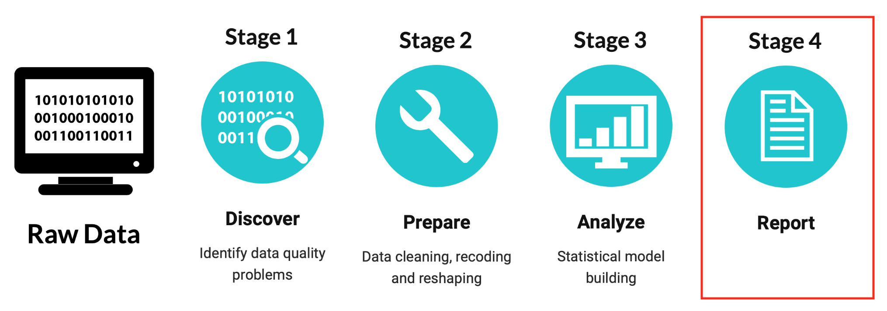
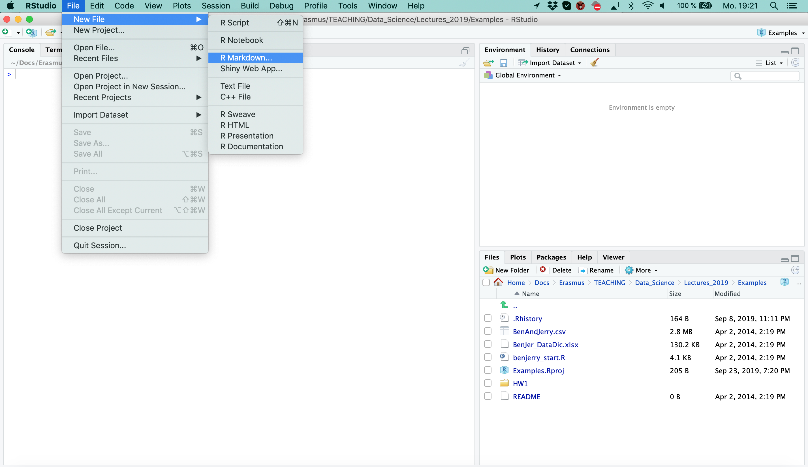
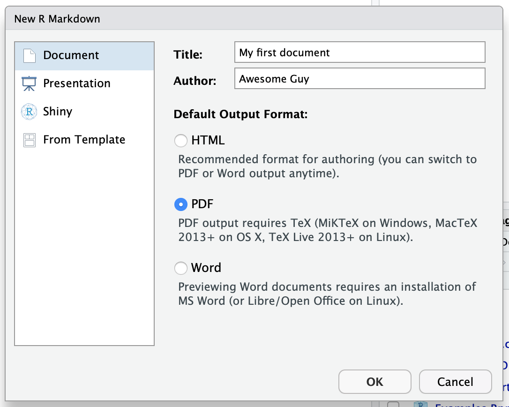
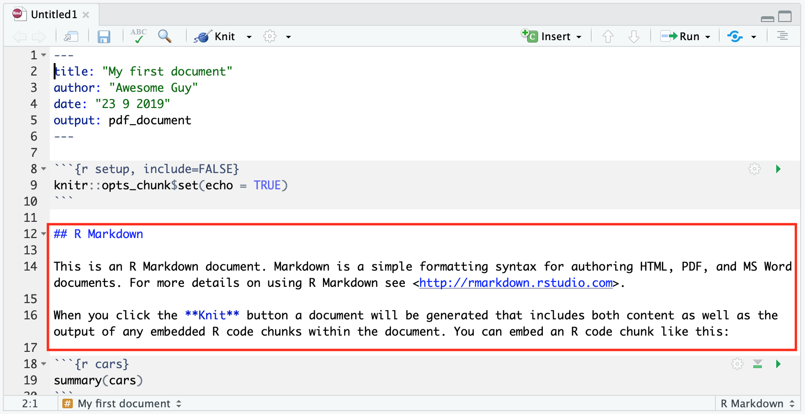
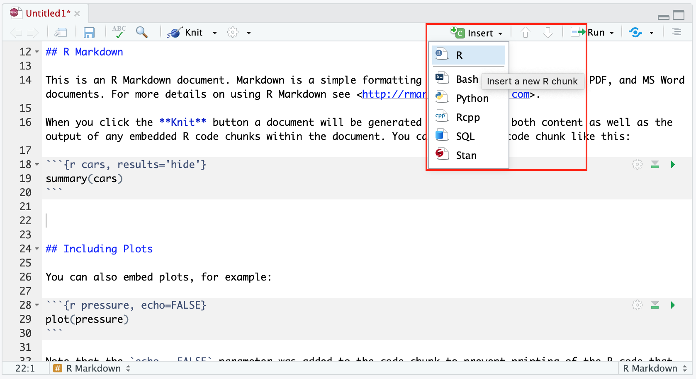
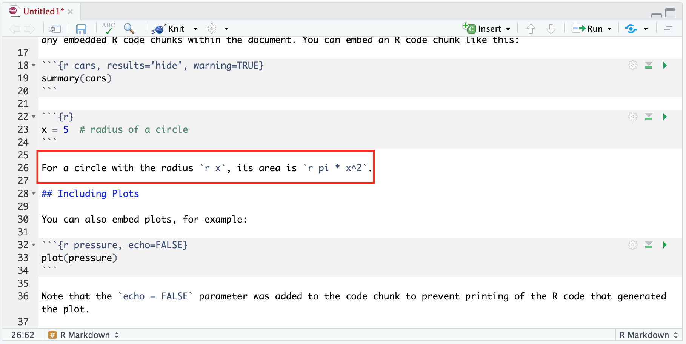
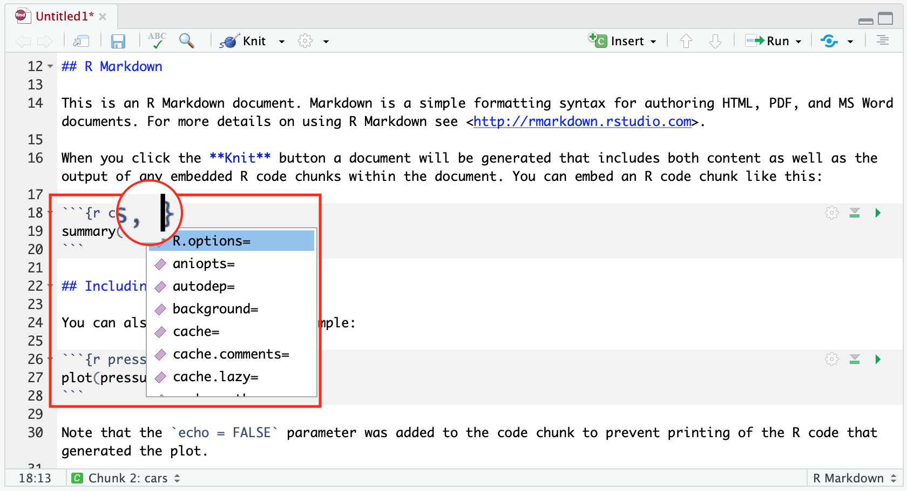
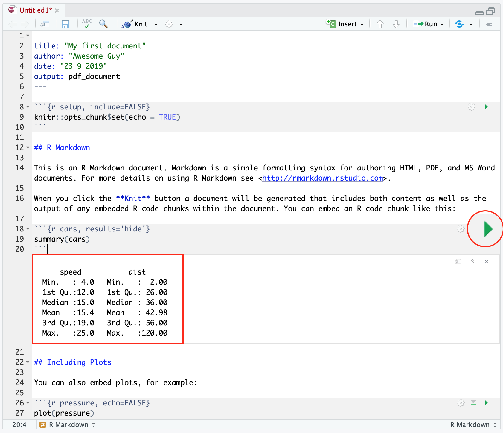
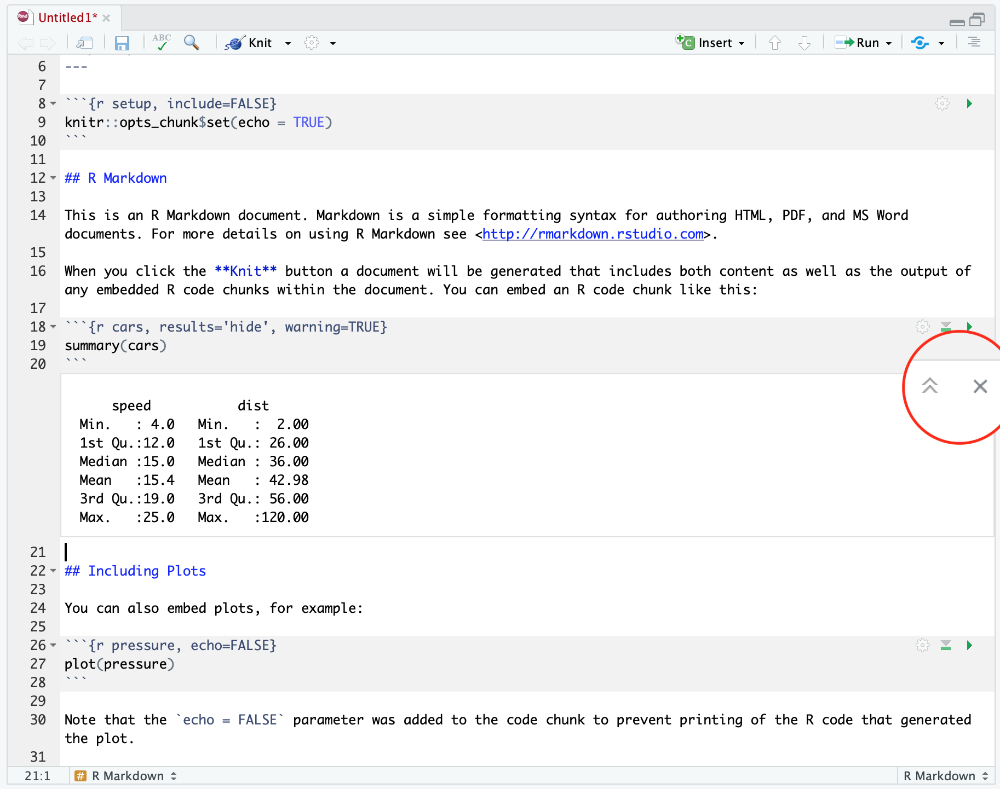
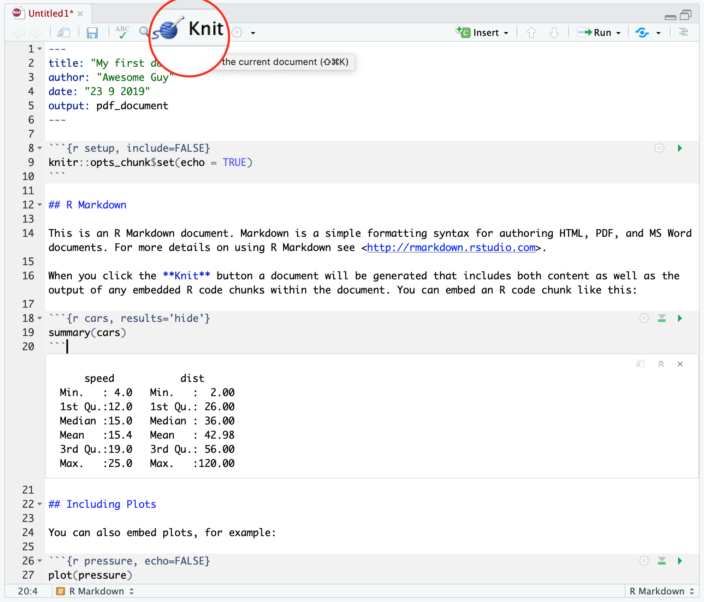

# The data science process



It doesn’t matter how great your analysis is unless you can explain it to others: you need to **communicate** your results!

* Communicating to **decision makers**, who want to focus on the conclusions and not the code behind the analysis.

* Collaborating with **other (data) scientists**, who are interested in both the conclusions, and the code.

<br>

# RMarkdown

(See also R for Data Science, Chapter 1 \& 22, or https://r4ds.had.co.nz/r-markdown.html Chapter 5.27, 5.29 \& 5.30)

RMarkdwon is a file format for designing documents that allow to combine code, results, and written text and to store your results in a variety of formats. 

RMarkdown documents rely on three different frameworks:

1. **YAML** for render parameters

2. **knitr** for embedded R code

3. **markdown** for formatted text

> Reports are fully reproducible (although code is not necessarily displayed).

> Reports can be updated automatically with `knitr` (time saving, e.g. when placing figures and tables).

**NOTE!** The necessary add-on packages (`rmarkdown` and `knitr`) are automatically installed in your R package library when installing RStudio. But RStudio does not build PDF and Word documents from scratch. You will need to have Microsoft Word (or a similar program) installed to produce Word Files. For rendering pdf files you will also need a **TeX** distribution (**miktex** for windows https://miktex.org/download, **mactex** for mac https://tug.org/mactex/mactex-download.html).

<br>

# Getting started





A template RMarkdown script is provided. 

<br>

## 1. YAML for render parameters

The YAML header (at the top of the page in between two lines of three dashes) includes the set up information used by `knitr` during rendering to produce the file:


Selection of available document output formats:

| Format | Document | Presentation |
|--------|----------------|--------------------------|
| HTML | `html_document` | `ioslides_presentation`, `xaringan`, `reveal.js` |
| PDF | `pdf_document` | `beamer_presentation` |
| Word | `word_document` | `powerpoint_presentation` |

* A **table of contents** can be added with the `toc` option. The depth of headers that it applies to is specified with the `toc_depth` option:

~~~~
---
title: "My first document"
output:
  pdf_document:
    toc: true
    toc_depth: 2
---
~~~~

If the table of contents depth is not explicitly specified, it defaults to 3 (meaning that all level 1, 2, and 3 headers will be included in the table of contents).

* **Section numberings** can be added to the headers eith the `number_sections` option:

~~~~
---
title: "My first document"
output:
  pdf_document:
    toc: true
    number_sections: true
---
~~~~

* **Width** and **height** of graphical output can be controlled (for example) with the `fig_width` and `fig_height` options:

~~~~
---
title: "My first document"
output:
  pdf_document:
    fig_width: 7
    fig_height: 6
---
~~~~

* Enhance the default display of **data frames** (output) with the `df_print` option:

~~~~
---
title: "My first document"
output:
  pdf_document:
    df_print: kable
---
~~~~

* Change the **syntax highlighting** style:

~~~~
---
title: "My first document"
output:
  pdf_document:
    highlight: tango
---
~~~~

Available highlighting styles are: default, tango, pygments, kate, monochrone, espresso, zenburn, haddock, null (prevents syntax highlighting).

* Further customizations of the template to create the PDF document:

~~~~
---
title: "My first document"
output: 
  pdf_document:
    fontsize: 11pt
---
~~~~

| Setting | Description |
|---------------------------------|--------------------------------------------------|
| `fontsize` | Font size (e.g., 10pt, 11pt, or 12pt) |
| `documentclass` | LaTeX document class (e.g., `article`) |
| `classoption` | Options for documentclass (e.g., `oneside`) |
| `geometry` | Options for geometry class (e.g., `margin=1in`) |
| `linkcolor`, `urlcolor`,  `citecolor` | Color for internal, external, and citation links |

<br>

## 2. Markdown formatted text

Markdown is a set of very easy-to-read conventions for formatting plain text:



* bold and italic text

* ordered and unordered lists

* headers (section titles)

* hyperlinks...

<br>

**Markdown reference guide**: 

Toolbar > **Help** > **Markdown Quick Reference** 

<br>

## Mathematical expressions

* **Inline** mathematical expressions can be written in a pair of dollar signs using the LaTeX syntax (see e.g. https://www.overleaf.com/learn/latex/Mathematical_expressions):

~~~~~
$f(k) = {n \choose k} p^{k} (1-p)^{n-k}$
~~~~~

* **Display style** mathematical expressions can be written in a pair of double dollar signs:

~~~~~
$$f(k) = {n \choose k} p^{k} (1-p)^{n-k}$$
~~~~~

<br>

## 3. knitr for embedded R code

The knitr package extends the basic markdown syntax to include chunks of executable R code. To embed a chunk of R code into your report, surround the code with two lines that each contain three backticks. After the first set of backticks, include `{r}`, which alerts knitr that you have included a chunk of R code. The result will look like this:


In a code chunk you can produce text output, tables, or graphics. When you render the report, knitr will run the code and add the results to the output file. In the output file you can have displayed just the code, just the results, or both.

**NOTE!** A new code chunk can be insered using either via the keyboard shortcut `Ctrl + Alt + I` (`Cmd + Option + I` on macOS) or the RStudio toolbar:



Besides code chunks, you can also insert values of R objects inline in text. For example:



<br>

## Chunk options

You have fine control over the output via **chunk options**, which can be provided inside the curly braces. For example, text output can be hidden via the chunk option `results = 'hide'`, or the height for a specific figure can be set to 4 inches via `fig.height = 4`. Multiple chunk options are separated by commas:

~~~
{r results = 'hide', fig.height = 4}
\end{verbatim}
~~~

Further code chunk options:



 Setting | Description |
|-----------------------|-----------------------------------------------|
| `echo = TRUE` | Omit code from the final report (and include the result only). |
| `results = 'hide'` | (Opposite) include code and omit results. |
| `eval = TRUE` | Wether to evaluate a code chunk. |
| `warning = TRUE` | Display warning messages? |
| `message = TRUE` | Display code messages? |
| `fig.height`, `fig.width` | Specify figure height and width.  |
| `fig.align` | Specify figure to right, left or center align. |
| `out.width`, `out.height` | Width and height to which figures are scaled. |


**NOTE!** In an RMarkdown file code and output are interleaved. Thus, you can run each code chunk independently by clicking the **Run** icon (or use the shortcut `Ctrl/ Cmd + Shift + Enter`, like in an R-Script file). RStudio executes the code and displays the results inline with the code:



**NOTE!** The output produced from an RMarkdown chunk is shown in the chunk output rather than, for example, the RStudio Viewer or the Plots pane. Console output (including warnings and messages) appears both at the console and in the chunk output.

You can clear an individual chunk’s output by clicking the **X** button in the upper right corner of the output, or collapse it by clicking the chevron:



<br>

# Compile an RMarkdown file

The `rmarkdown` package will call the `knitr` package. `knitr` will run each chunk of R code in the document and append the result of the code in the document next to the code chunk.

To produce a complete report containing all text, code, and results, click “Knit” (or use the shortcut `Ctrl/Cmd + Shift + K`).



When you knit the document, `rmarkdown` sends the `.Rmd` file to `knitr`. The `knitr` pacakge will run each chunk of R code in the document and append the result of the code in the document next to the code chunk. The file generated by `knitr` is then processed by `pandoc` (http://pandoc.org/) which is responsible for creating the finished file. The advantage of this two step workflow is that you can create also create `.html` and `.docx` output formats.


<br>

# Formatting tables

There are several packages for producing tables, including `xtable`, `Hmisc`, `stargazer`, `kableExtra` and `pander` (Note: not all packages are compatible with every output format).

For example, the `kable()`-function from the package `kableExtra` takes a matrix or data frame as input and returns it into a nicely formatted table for use with RMarkdown:

```{r}
library(kableExtra)
# create a matrix like input object
df <- summary(cars)
kable(df, format = "latex", booktabs = TRUE, caption = "Demo Table") %>%
  kable_styling(latex_options = c("striped", "hold_position"), 
                full_width = FALSE) %>%
  add_footnote(c("table footnote"))
```

Whereas `stargazer` creates summary tables taking the raw data as input:

```{r}
library(stargazer)
stargazer(cars, type = "latex", title = "Demo Table", digits = 2, 
          summary.stat = c("mean", "sd", "median", "min", "max"))
```

