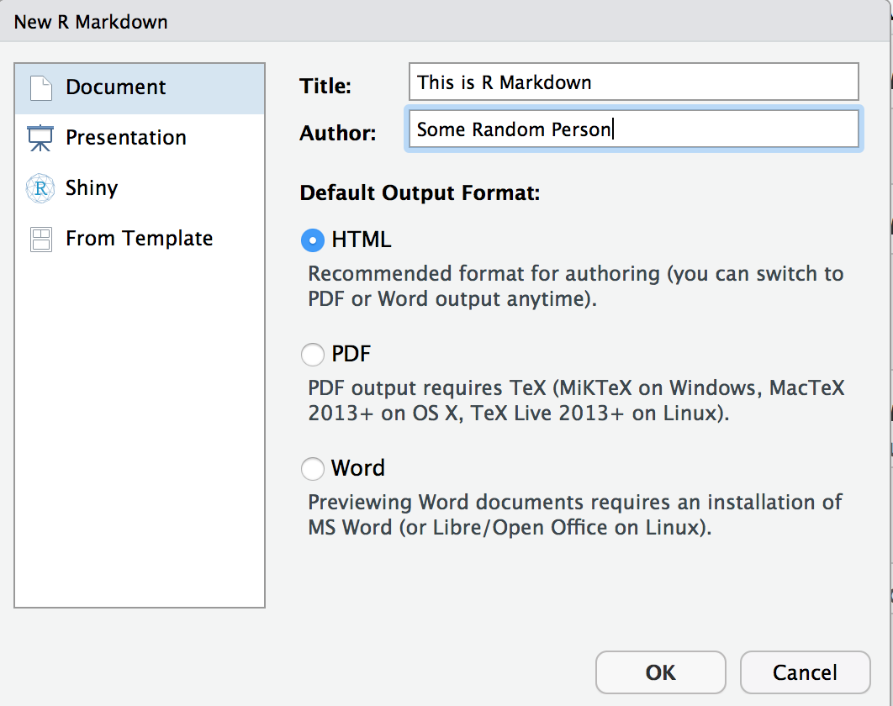
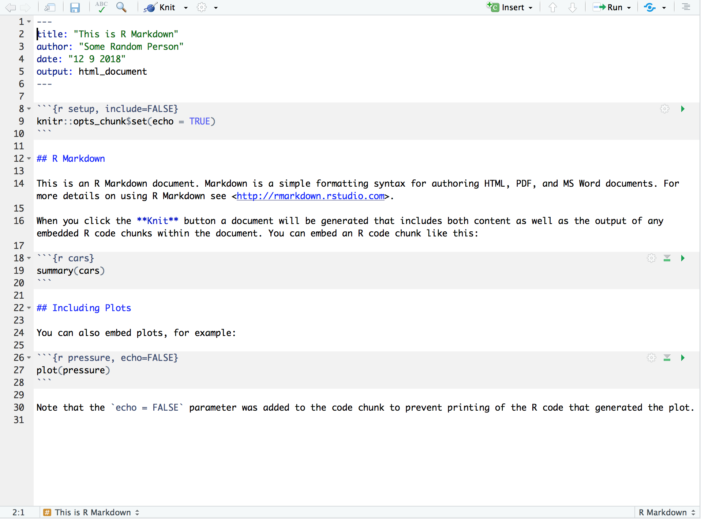
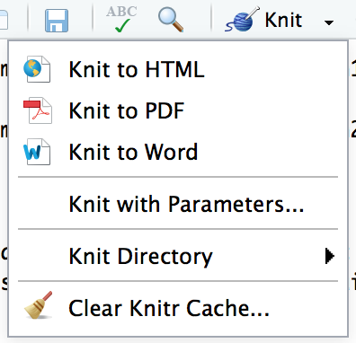
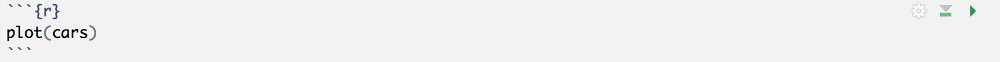
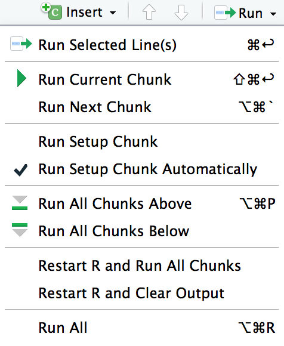

# Markdown and R Markdown

- Markdown is a simple (easy-to-write / easy-to-read) text-based markup language with *plain text* formatting syntax.

- can be easily shared between computers, mobile phones, and people. It’s quickly becoming the writing standard for academics, scientists, writers, and many more. Websites like GitHub and reddit use Markdown to style their comments.

- R Markdown is a variation of Markdown that allows documentation in a variety of formats for creating dynamic and reproducible documents in R (contains formatted text and chunks of embedded R code).

- R Markdown reports rely on three frameworks:

1. **markdown** for formatted text
2. **knitr** for embedded R code
3. **YAML** for render parameters

# 1. Markdown for formatted text

Markdown is a set of very easy to use conventions for formatting *plain text*:

- bold and italic text
- lists
- headers
- hyperlinks

*Syntax guide*: Toolbar > **Help** > **Markdown Quick Reference**

Plaintext is just the regular alphabet, with a few familiar symbols, like asterisks ( * ) and backticks (` `). All you have control over is the display of the text—stuff like making things bold, creating headers, and organizing lists.

# 2. knitr for embedded R code

The knitr package extends the basic markdown syntax to include chunks of executable R code.

*knitr guide*: Toolbar > **Help** > **Markdown Quick Reference**

- When *rendering* the document, knitr will run the code and append the results to the code chunk.
- Provides formatting and syntax highlighting to both the code and its results.

## Code chunk options

- `name` (chunk label, not necessarily requored)
- `echo = TRUE` (sisplay the code chunk or just show the results?)
- `eval = TRUE` (run the code in the code chunk?)
- `warning = TRUE` (display warning messages in the document?)
- `message = TRUE` (display code messages in the document?)
- `results` (specify appearance of the the results)
- `fig.align` (specify figure to appear `right`, `left`, or `center` aligned)
- `fig.height`, `fig.width` (specify height and width of the figure)
- `out.width`, `out.height (width/height to which plots are scaled in the final document)

# 3. YAML for render parameters

The YAML header controls how rmarkdown renders the `.Rmd` file.

## Documents

- `output: html_document` (generates html document, default)
- `output: pdf_document` (generates pdf document)
- `output: word_document` (generates word document)

### Table of contents 

- `toc: true` (generates the table of contents)
- `toc_depth: 2` (table of contents includes sections and subsections)
- `number_sections: true` (include section numberings)

### Figure options

- `fig_width: 7` (controls the default figure width)
- `fig_height: 6` (controls the default figure height)
- `fig_caption: true` (controls whether figures are rendered with captions)

### Data frame printing

- `df_print: default`
- `df_print: kable`
- `df_print: tibble`

### Syntax highlighting

- `highlight: default`
- `highlight: tango`
- `highlight: pygments`
- `highlight: kate`
- `highlight: monochrone`
- ...
- `highlight: null` (prevents syntax highlighting)

## Presentations

**Built-in formats**

- `output: powerpoint_presentation` (ppt document)
- `output: beamer_presentation` (pdf presentation)
- `output: ioslides_presentation` (html presentation)

**Usage**

- `#`, `##` headers indicate a new slide
- `---` indicates a new slide without header

### Power Point

- `reference_doc: my-styles.pptx` (customizes the appearance of the presentation by passing a custom reference document)

### Beamer

Appearance features:

- `theme: "default"`
- `theme: "AnnArbor"`
- `theme: "Berlin"`
- `theme: "CambridgeUS"`
- `theme: "Copenhagen"`
- `theme: "..."`

Colortheme features:

- `colortheme: "default"`
- `colortheme: "albatross"`
- `colortheme: "beetle"`
- `colortheme: "dolphin"`
- `colortheme: "..."`

See also:

https://hartwork.org/beamer-theme-matrix/

### Ioslides

Features: 

- `incremental: true` (incremental bullets, e.g., `> -` Bullet 1)
- `widescreen: true` (wider form factor)
- `smaller: true` (smaller text)
- `transition: default` (transition speed: `slower`, `faster`, or a numeric value with a number of seconds)
- `|` add subtitle to a slide or section 
- `logo: logo.png` (adding a logo)

**NOTE:** Images and tables will always be placed on new slides (togehter with the slide header and image/table caption). 

# Getting started

1. Open a new R Markdown file: Toolbar > **File** > **New File** > **R Markdown**

A template R Markdown script is provided. This includes the set up information at the top of the page in between two lines of three dashes (YAML settings used by knitr during rendering to produce the file). 

2. Render the file.

Rmarkdown will use the pandoc program to transform the file into a new format. Rmarkdown will preserve the text, code results, and formatting contained in the original `.Rmd` file.

**NOTE:** The selection you make will override the output!

2. Render the file.

* Notebooks are **previewed**.
* Preview is a rendered copy of the Markdown output of the document.

## Executing Code

* Using the green triangle button on the toolbar of a code: `Run Current Chunk`

* Using the hotkey combination `Ctrl + Enter` (macOS: `Cmd + Enter`)

* Using the editor toolbar

After code execution, an indicator will appear in the gutter to show the execution progress. Sent lines are marked in green, lines that have not yet been sent are marked with light green. 

Output appears beneath the code chunk that produced it.

## Errors 

Execution stops and the remaining lines of that chunk (and any chunks that have not yet been run) are not executed.

The line of code that caused the error havs a red indicator in the editor’s gutter.

